
 <!-- начало главы -->

Билль о помощи






 <!-- конец главы -->

 <!-- начало главы -->

Отплытие конвоя



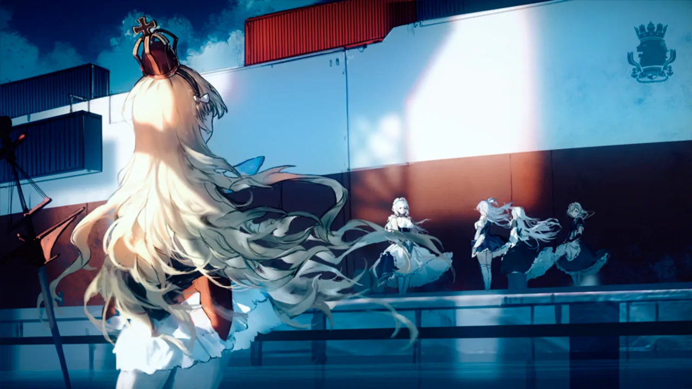



 <!-- конец главы -->

 <!-- начало главы -->

Изменения в плане

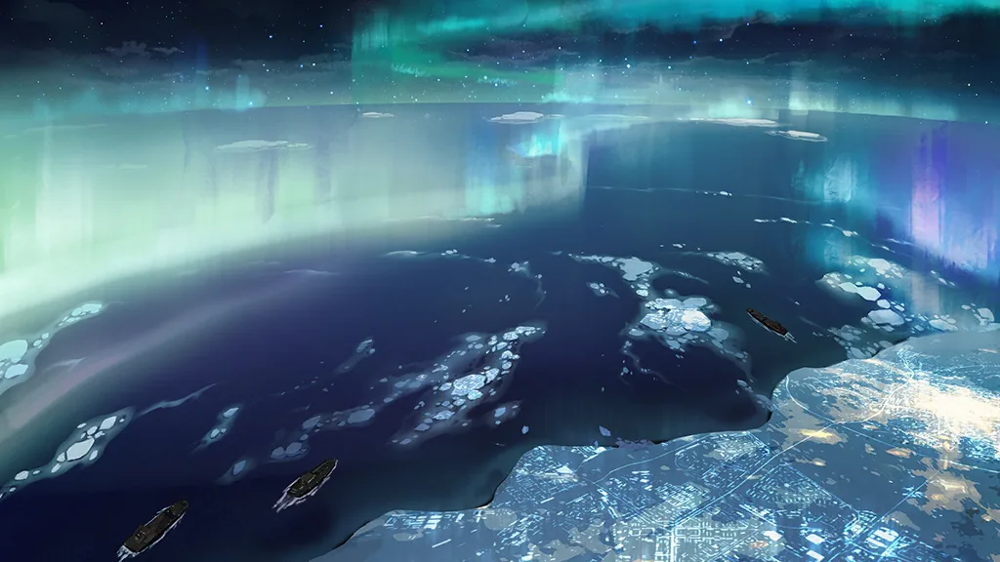




 <!-- конец главы -->

 <!-- начало главы -->

Аврора




 <!-- конец главы -->

 <!-- начало главы -->

Засада




 <!-- конец главы -->

 <!-- начало главы -->

Анализ




 <!-- конец главы -->

 <!-- начало главы -->

Приказ о возвращении







 <!-- конец главы -->

 <!-- начало главы -->

Операция “Призрачный свет”

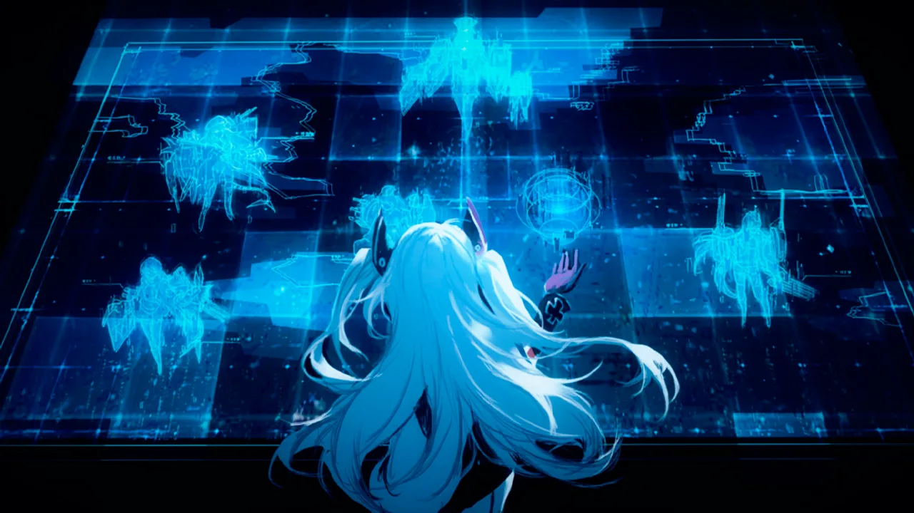




 <!-- конец главы -->

 <!-- начало главы -->

Под полярным сиянием




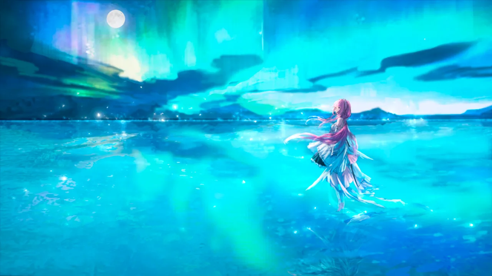



 <!-- конец главы -->

 <!-- начало главы -->

Местоположение раскрыто




 <!-- конец главы -->

 <!-- начало главы -->

Уловка




 <!-- конец главы -->

 <!-- начало главы -->

Авангард Железной Крови




 <!-- конец главы -->

 <!-- начало главы -->

«Демон» и «Вампир»




 <!-- конец главы -->

 <!-- начало главы -->

Сомнения










 <!-- конец главы -->

 <!-- начало главы -->

Эскорт

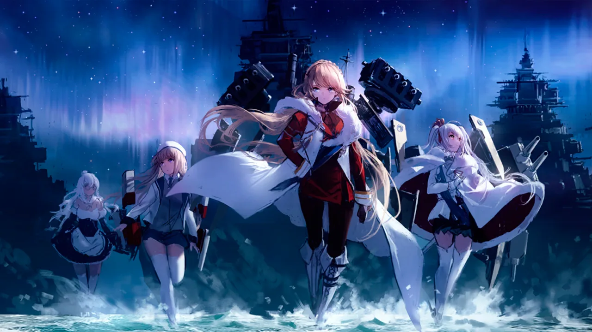







 <!-- конец главы -->

 <!-- начало главы -->

Встреча




 <!-- конец главы -->

 <!-- начало главы -->

Незванные гости




 <!-- конец главы -->

 <!-- начало главы -->

Огонь на полную




 <!-- конец главы -->

 <!-- начало главы -->

Анализ и выбор




 <!-- конец главы -->

 <!-- начало главы -->

Интерлюдия

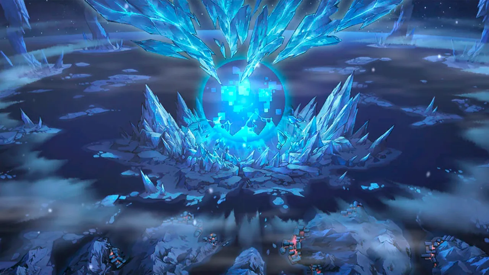



 <!-- конец главы -->

 <!-- начало главы -->

Третий приказ

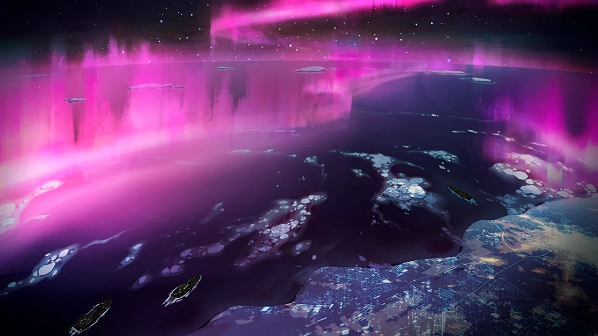




 <!-- конец главы -->

 <!-- начало главы -->

Подготовка к атаке




 <!-- конец главы -->

 <!-- начало главы -->

Эскортный флот

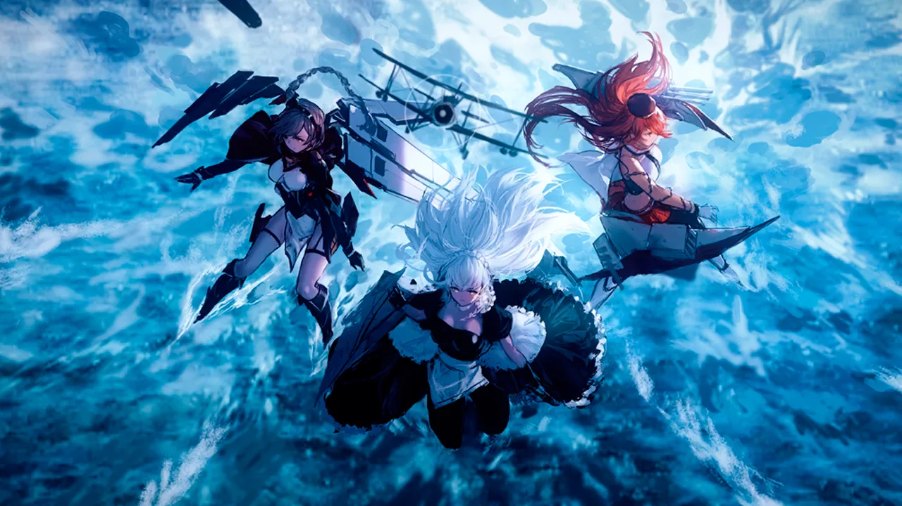




 <!-- конец главы -->

 <!-- начало главы -->

Атака волчьей стаи




 <!-- конец главы -->

 <!-- начало главы -->

Угроза устранена







 <!-- конец главы -->

 <!-- начало главы -->

Несуществующий флот





 <!-- конец главы -->

 <!-- начало главы -->

Разоблачение




 <!-- конец главы -->

 <!-- начало главы -->

Тот, кто путает карты




 <!-- конец главы -->

 <!-- начало главы -->

Вне плана










 <!-- конец главы -->

 <!-- начало главы -->

Снова в путь

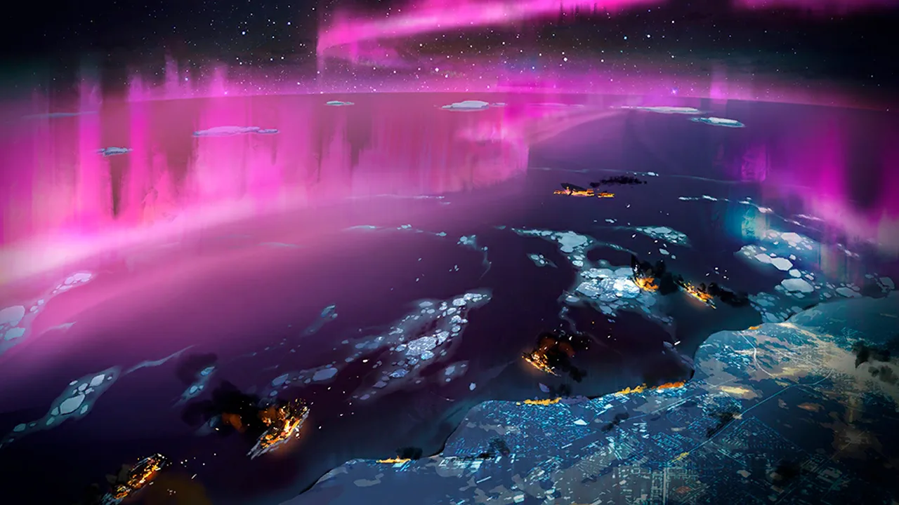



 <!-- конец главы -->

 <!-- начало главы -->

Огневое подавление





 <!-- конец главы -->

 <!-- начало главы -->

Омиттер




 <!-- конец главы -->

 <!-- начало главы -->

Королевский этикет




 <!-- конец главы -->

 <!-- начало главы -->

Контрмеры




 <!-- конец главы -->

 <!-- начало главы -->

Сходный финал






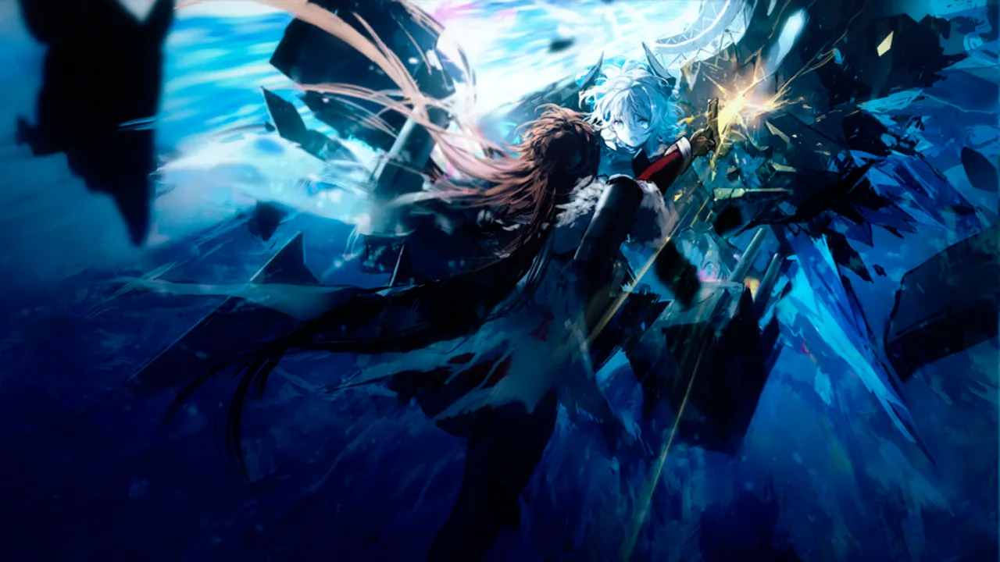



 <!-- конец главы -->

 <!-- начало главы -->

Истинные цели Железной Крови




 <!-- конец главы -->

 <!-- начало главы -->

Северный фронт



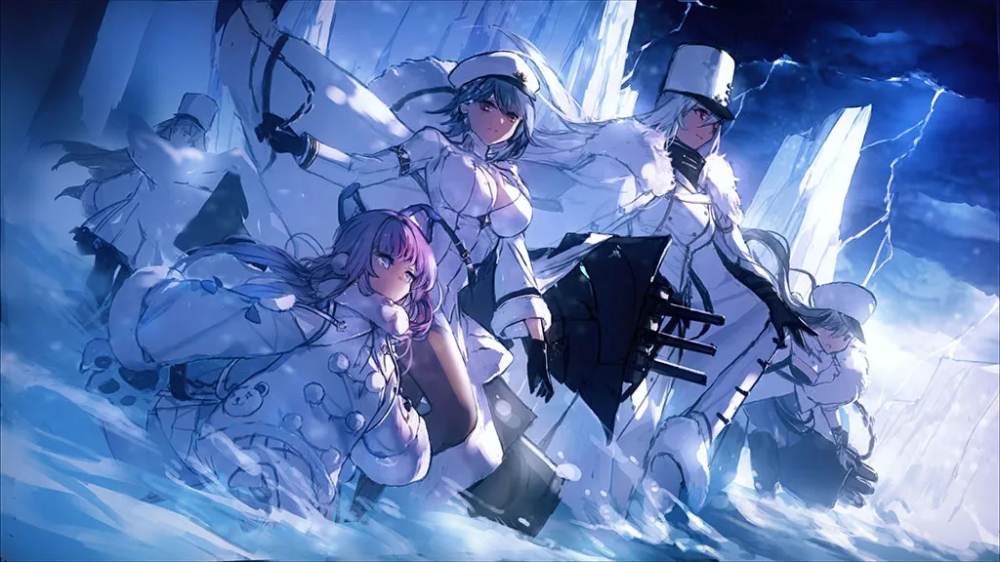






 <!-- конец главы -->

 <!-- начало главы -->

Скапа-Флоу





        
    










 <!-- конец главы -->

 <!-- начало главы -->

Всеобщее оповещение



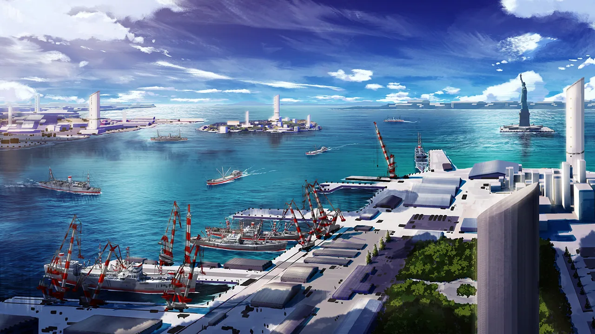




 <!-- конец главы -->

 <!-- начало главы -->

Новый этап





 <!-- конец главы -->