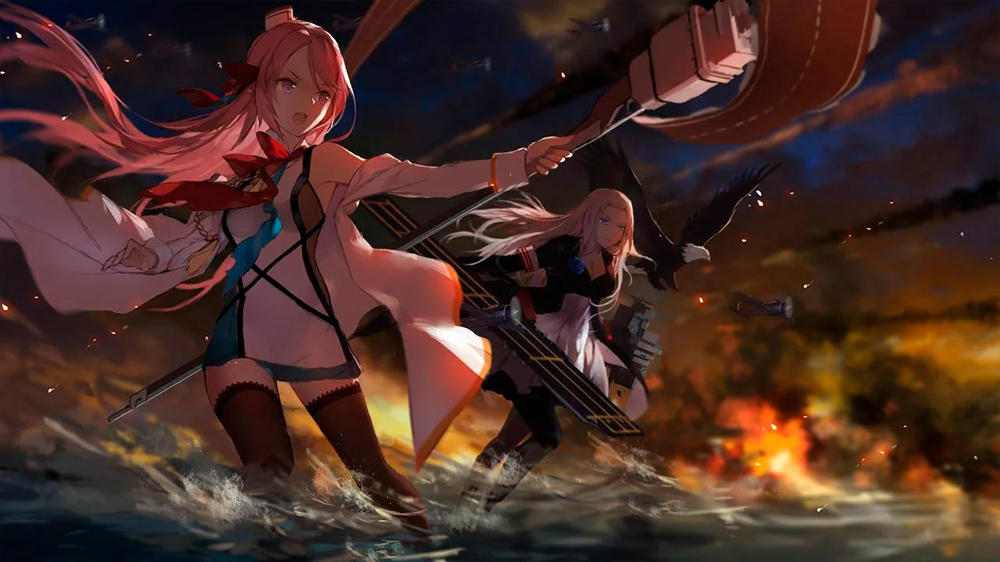
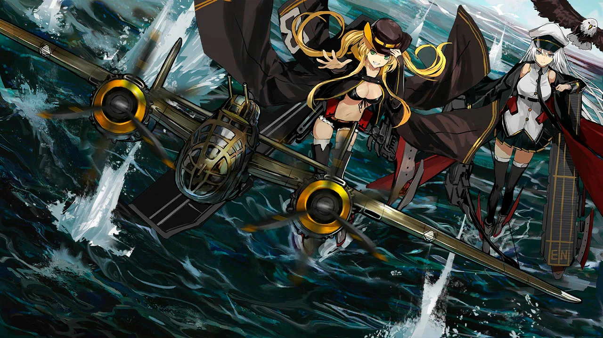

 <!-- начало главы -->

Часть 2: Коралловое море





 <!-- конец главы -->

 <!-- начало главы -->

Часть 2: Увертюра контратаки








 <!-- конец главы -->

 <!-- начало главы -->

Часть 2: Следующий Город




 <!-- конец главы -->