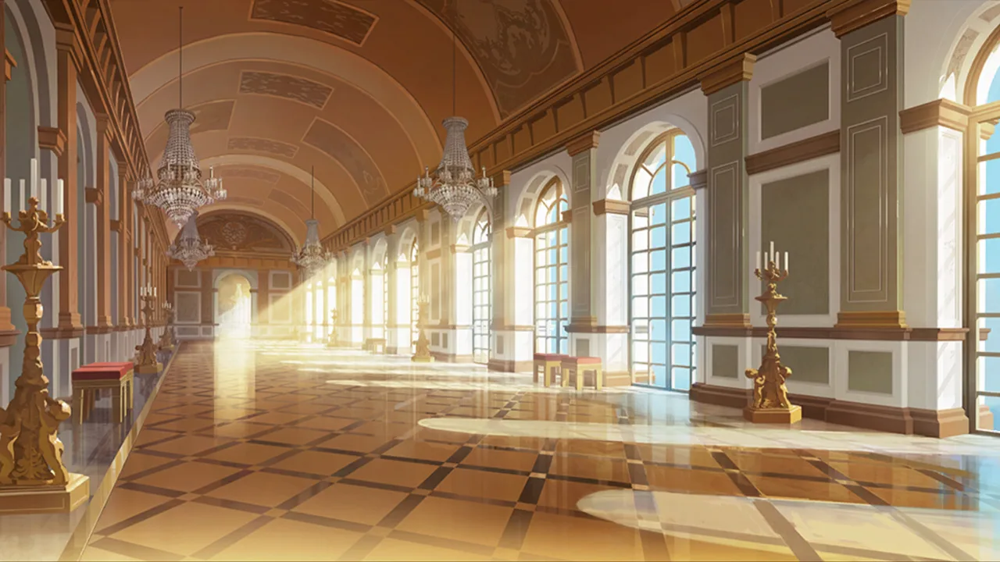

 <!-- начало главы -->

Европейские каникулы














 <!-- конец главы -->

 <!-- начало главы -->

Партия королев








 <!-- конец главы -->

 <!-- начало главы -->

У Великого Священного древа















 <!-- конец главы -->

 <!-- начало главы -->

Голос из раковины







 <!-- конец главы -->

 <!-- начало главы -->

Внешний рубеж обороны











 <!-- конец главы -->

 <!-- начало главы -->

Меч возвращается в ножны





 <!-- конец главы -->

 <!-- начало главы -->

Прекрасное будущее










 <!-- конец главы -->