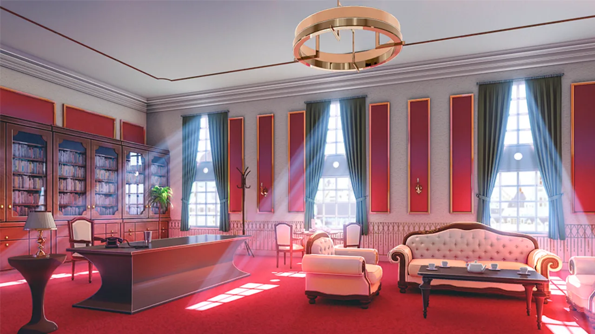
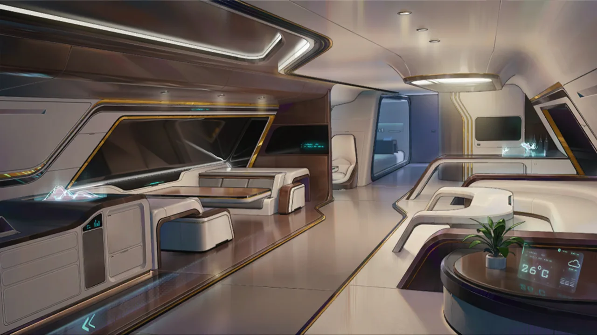
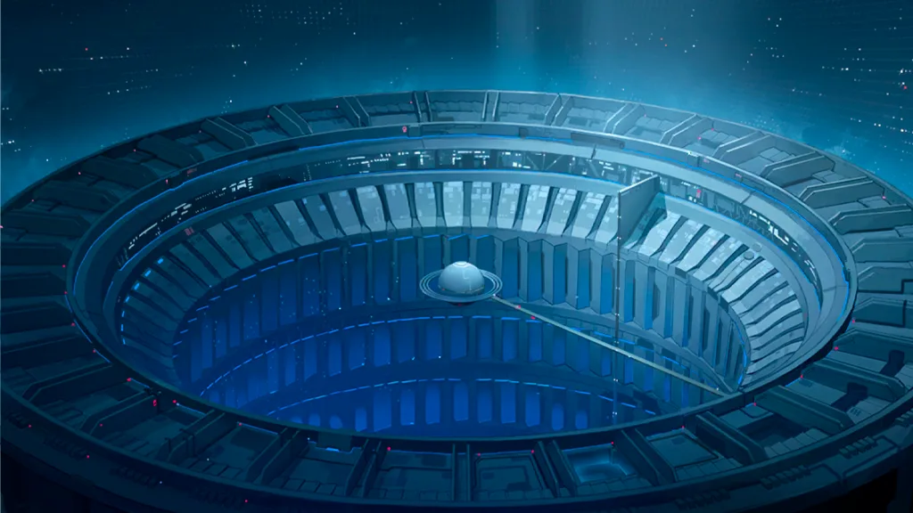
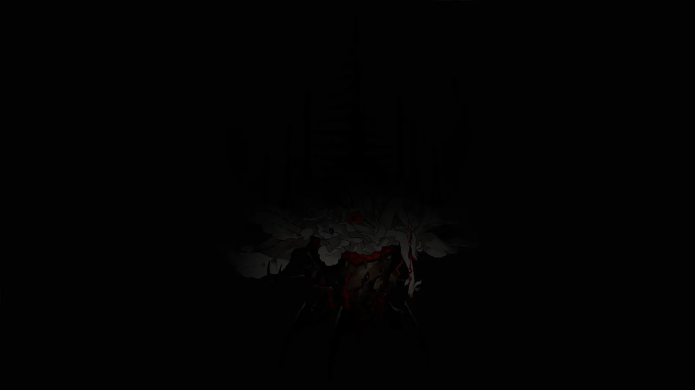

 <!-- начало главы -->

Элементы тестирования

















 <!-- конец главы -->

 <!-- начало главы -->

Преломление света













 <!-- конец главы -->

 <!-- начало главы -->

Накануне операции











 <!-- конец главы -->

 <!-- начало главы -->

Точка фокусировки

















 <!-- конец главы -->

 <!-- начало главы -->

Пространство записей



































 <!-- конец главы -->

 <!-- начало главы -->

Экстренные полномочия





 <!-- конец главы -->

 <!-- начало главы -->

Всевидящее око RE










 <!-- конец главы -->
