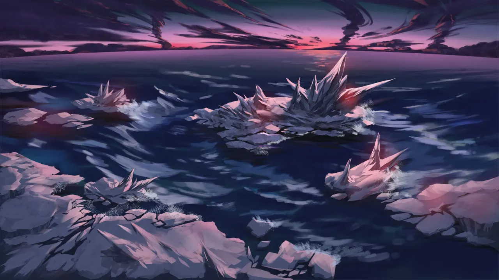
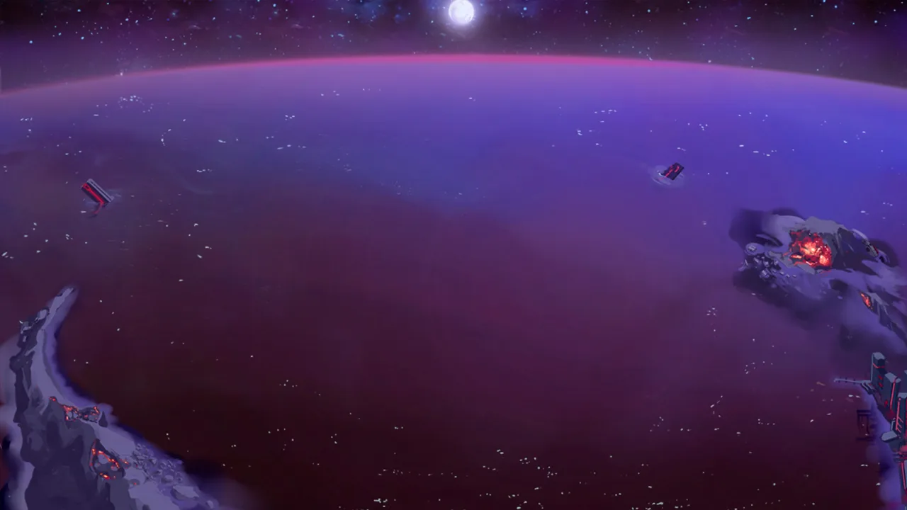
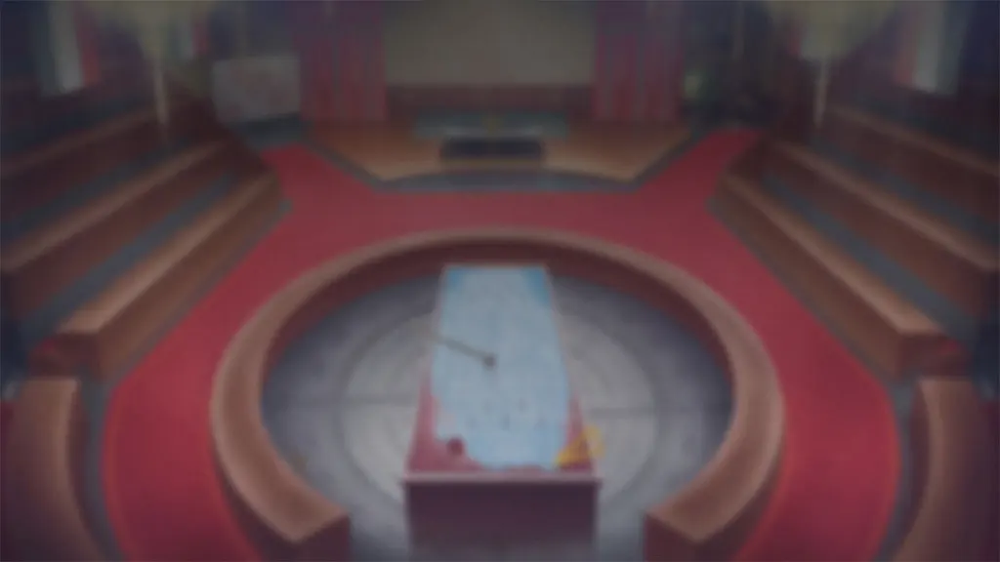

 <!-- начало главы -->

Секретная операция








 <!-- конец главы -->

 <!-- начало главы -->

Прошлое





 <!-- конец главы -->

 <!-- начало главы -->

Инцидент с помехами




 <!-- конец главы -->

 <!-- начало главы -->

Искренность





 <!-- конец главы -->