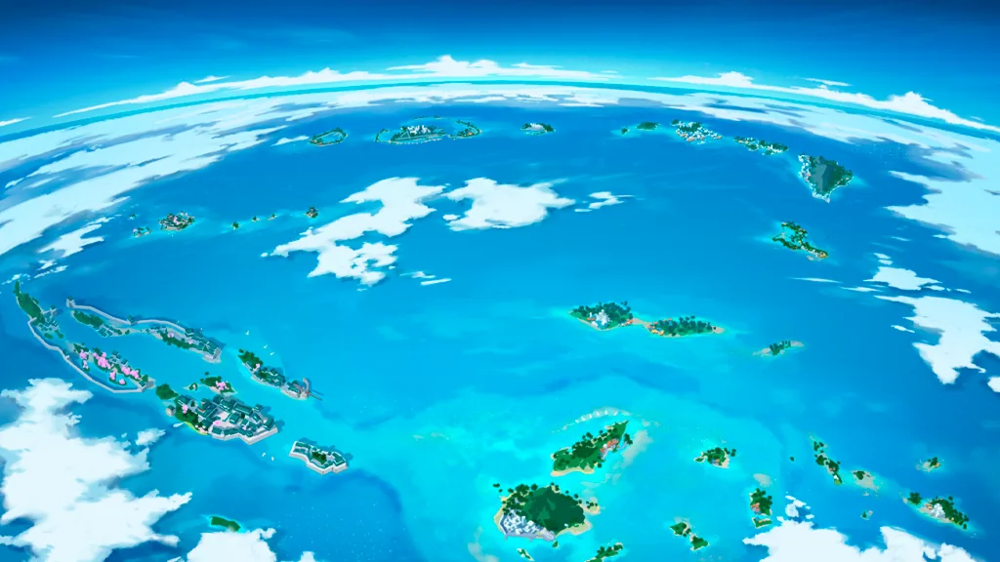
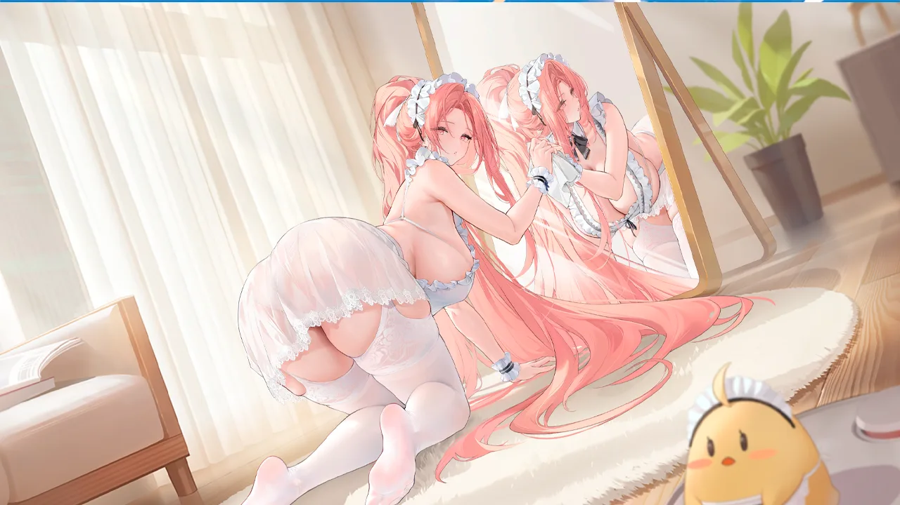
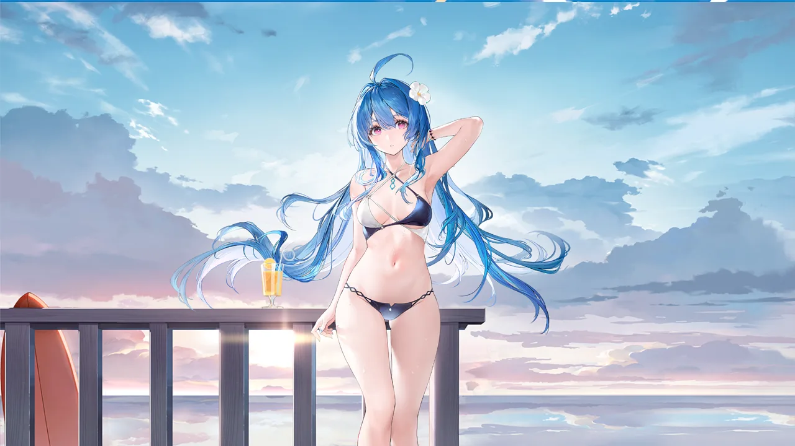
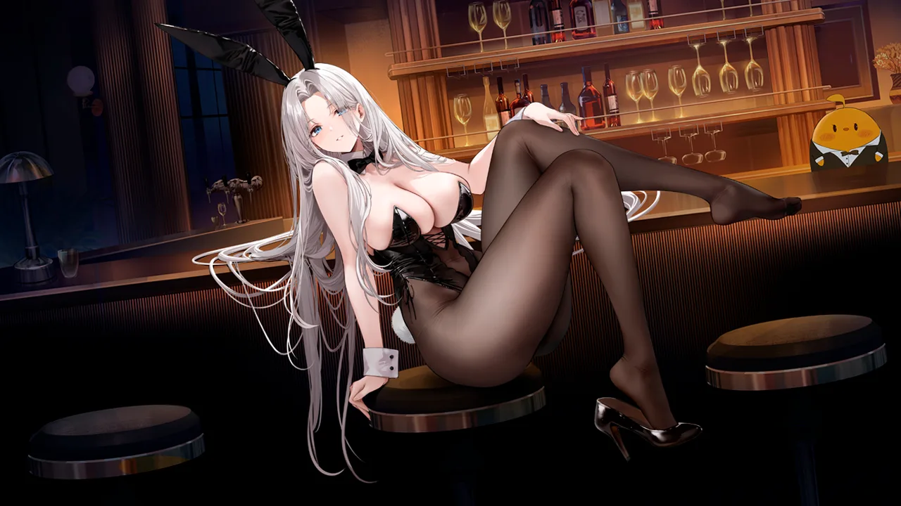
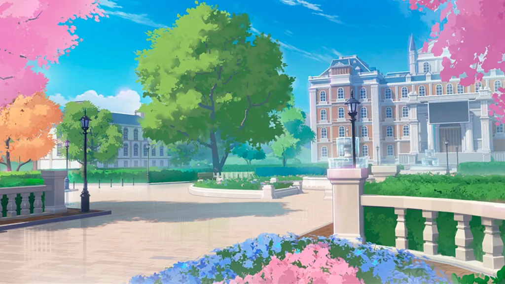
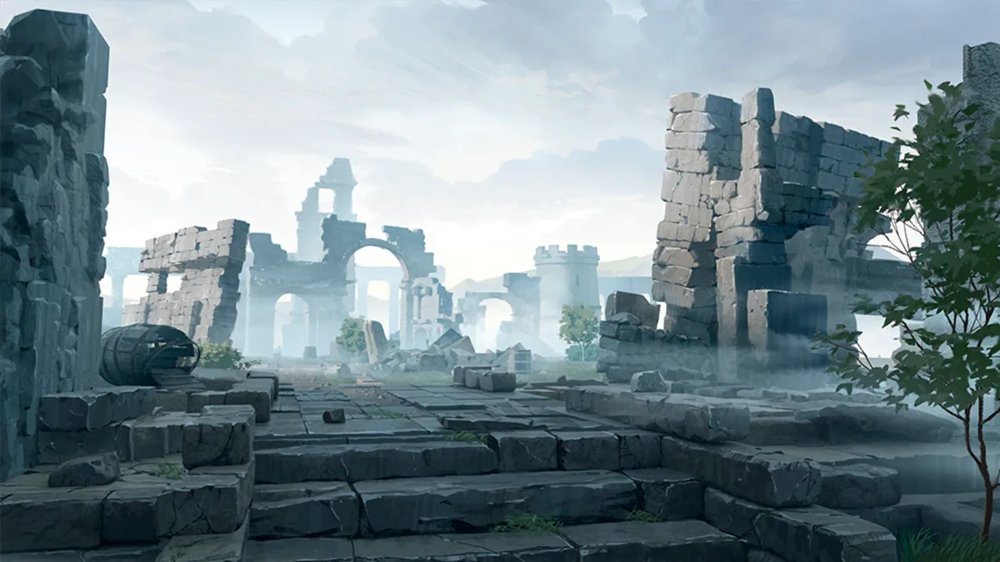

 <!-- начало главы -->

Первый творческий отпуск


































 <!-- конец главы -->

 <!-- начало главы -->

На самом видном месте











 <!-- конец главы --> 

 <!-- начало главы -->

В тумане
















 <!-- конец главы --> 

 <!-- начало главы -->

Предчувствие



















 <!-- конец главы -->

 <!-- начало главы -->

Анализ








 <!-- конец главы -->

 <!-- начало главы -->

Подготовка

















 <!-- конец главы -->

 <!-- начало главы -->

Гармония


















 <!-- конец главы -->