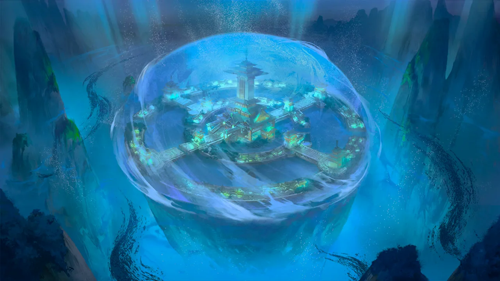
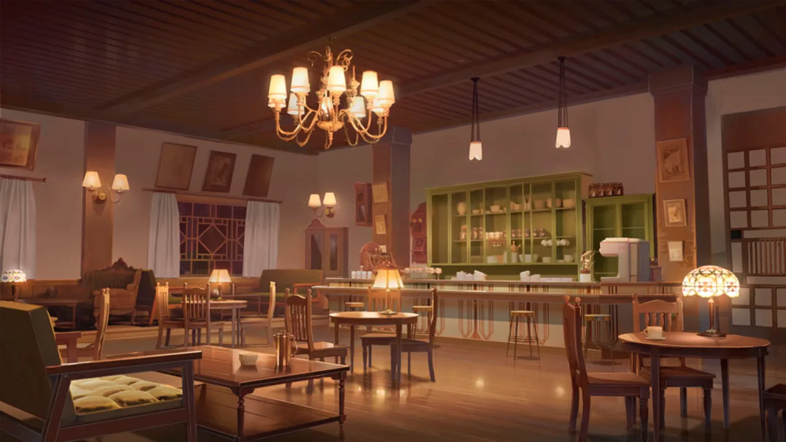

 <!-- начало главы -->

Во Дворце Дракона




 <!-- конец главы -->

 <!-- начало главы -->

Скиталица





 <!-- конец главы -->

 <!-- начало главы -->

Королевский экспресс




 <!-- конец главы -->

 <!-- начало главы -->

Удар












 <!-- конец главы -->

 <!-- начало главы -->

Ограниченная помощь








 <!-- конец главы -->

 <!-- начало главы -->

Мост Смерти




 <!-- конец главы -->

 <!-- начало главы -->

Межзвездный сон







































 <!-- конец главы -->

