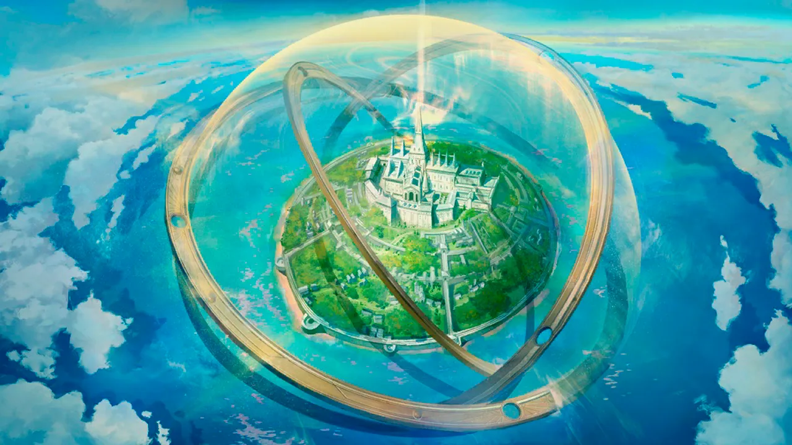
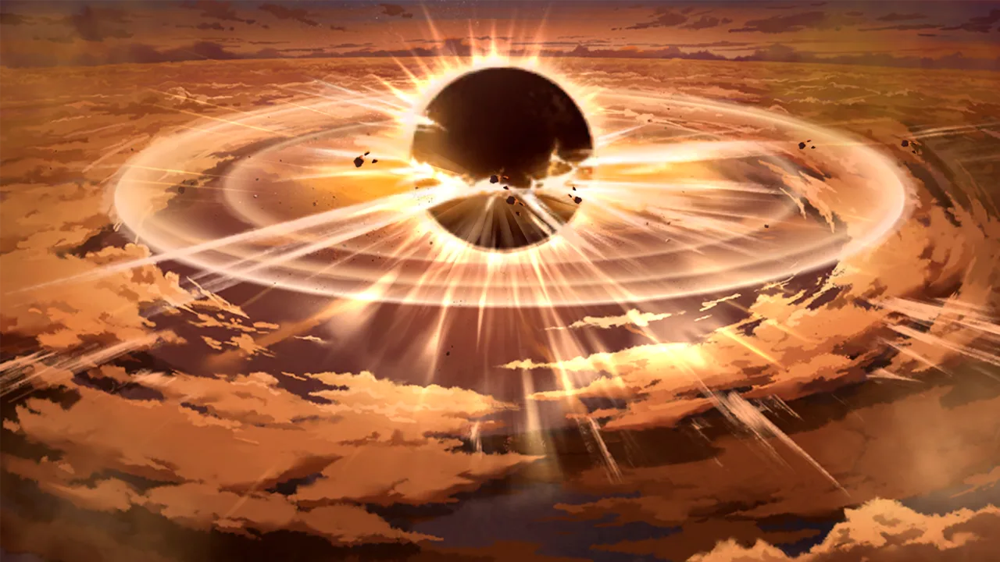
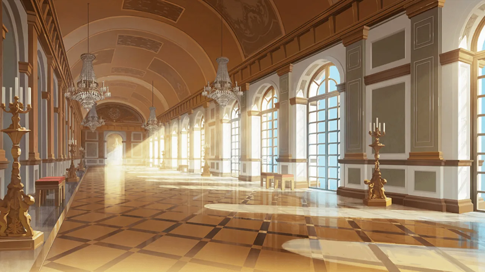
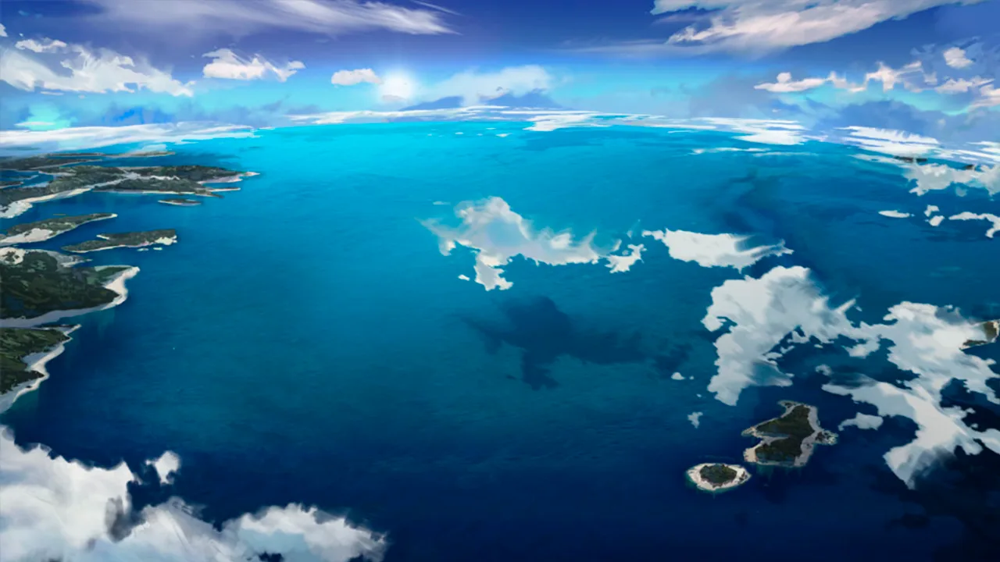
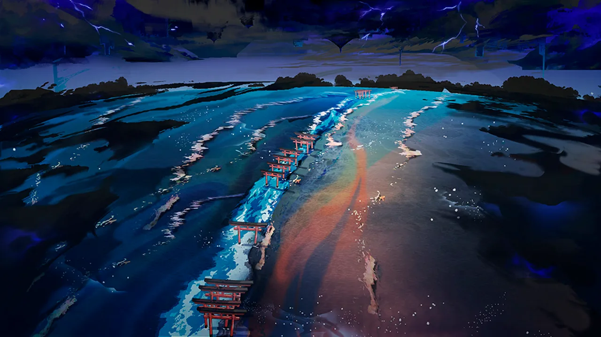
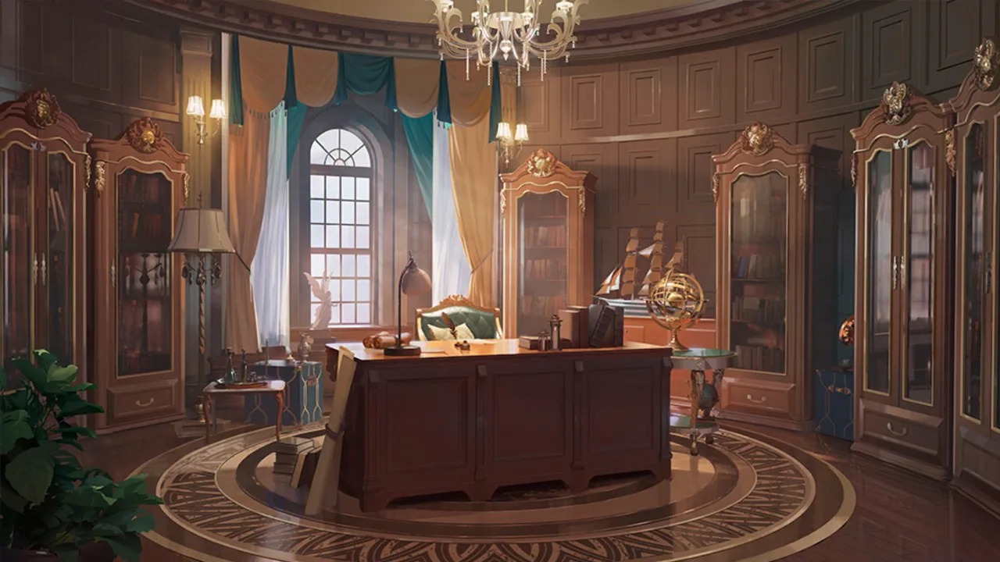
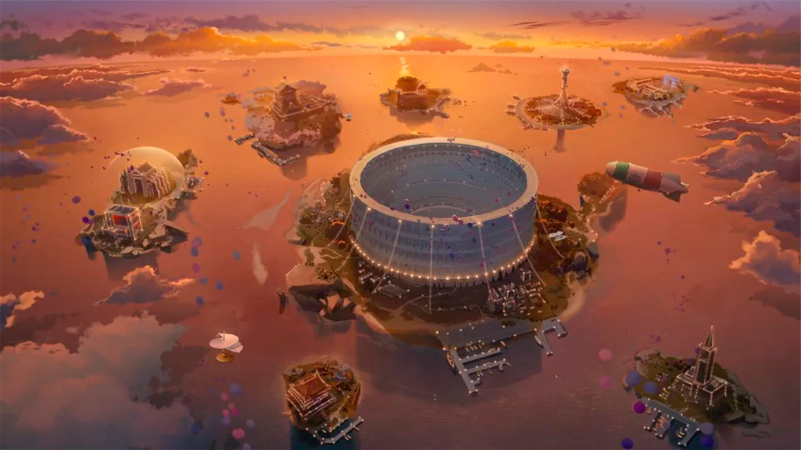

 <!-- начало главы -->

Предвестие коррозии







 <!-- конец главы -->

 <!-- начало главы -->

Утренний свет Восточной Европы











 <!-- конец главы -->

 <!-- начало главы -->

Время еще не пришло, наверное...






 <!-- конец главы -->

 <!-- начало главы -->

Жди, и...






 <!-- конец главы -->

 <!-- начало главы -->

Путешествие в отпуск












 <!-- конец главы -->

 <!-- начало главы -->

Возвращение из командировки, но...





 <!-- конец главы -->

 <!-- начало главы -->

Мимолетный сон





















 <!-- конец главы -->