
 <!-- начало главы -->

Рассвет зимы
























 <!-- конец главы -->

 <!-- начало главы -->

“Её” появление

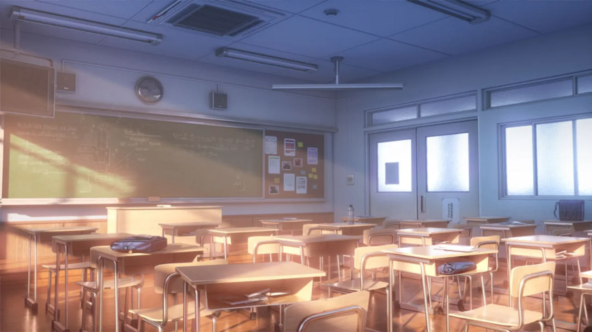






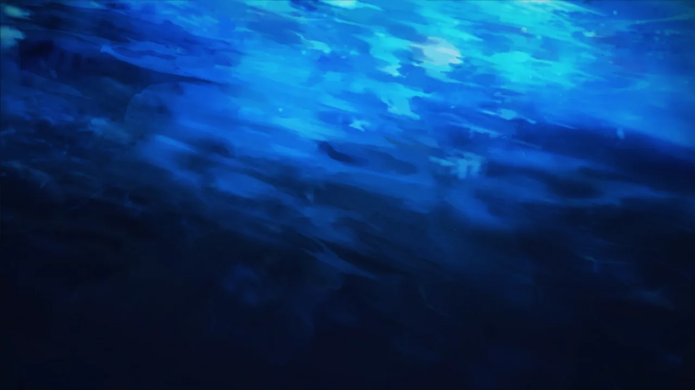









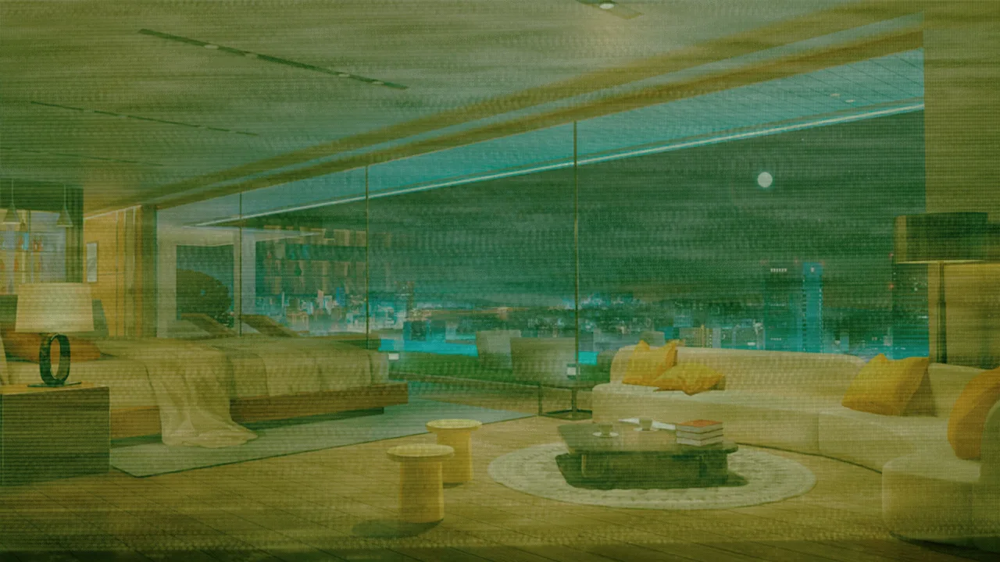

















 <!-- конец главы -->

 <!-- начало главы -->

Новая связь

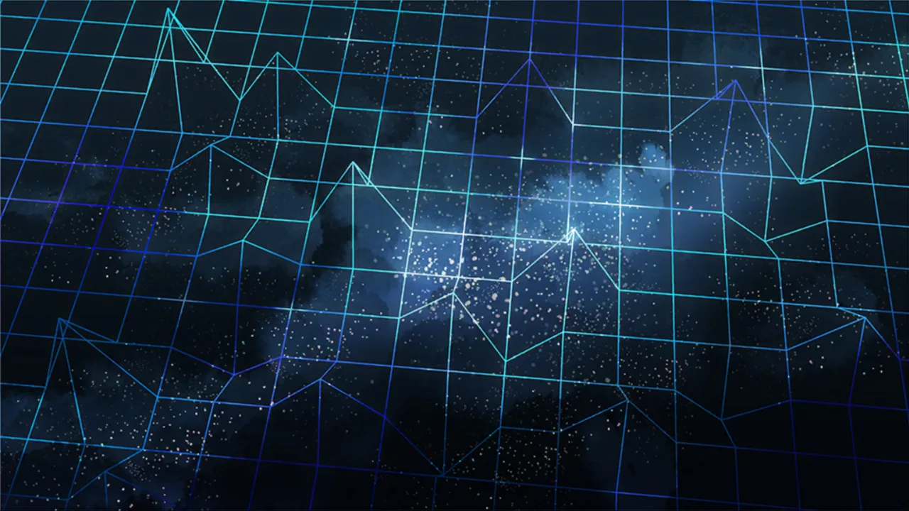




 <!-- конец главы -->

 <!-- начало главы -->

Что произошло дальше

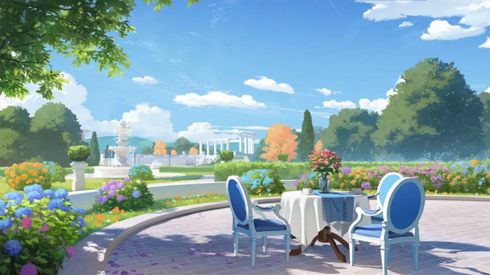










 <!-- конец главы -->

 <!-- начало главы -->

Зимняя стена











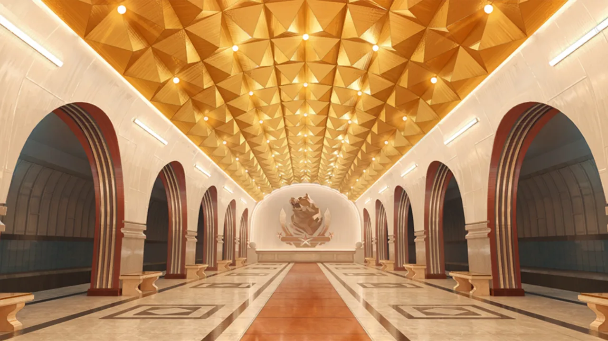









 <!-- конец главы -->

 <!-- начало главы -->

Поверхностное расследование

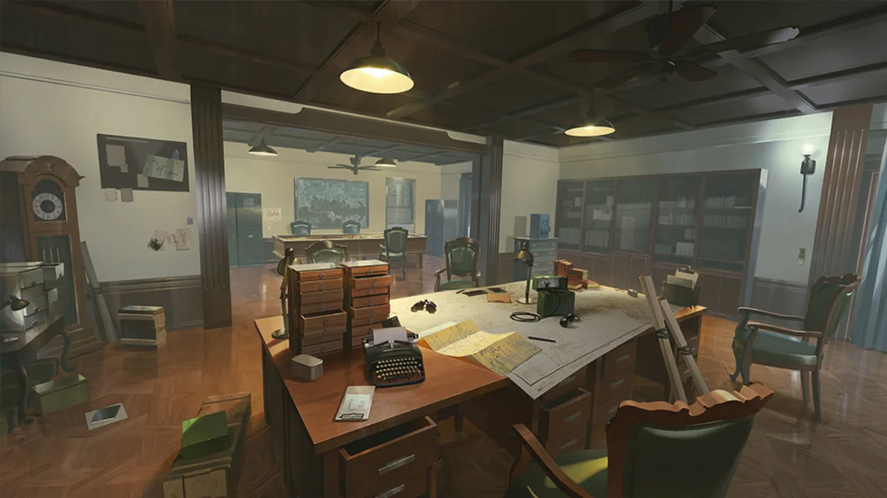



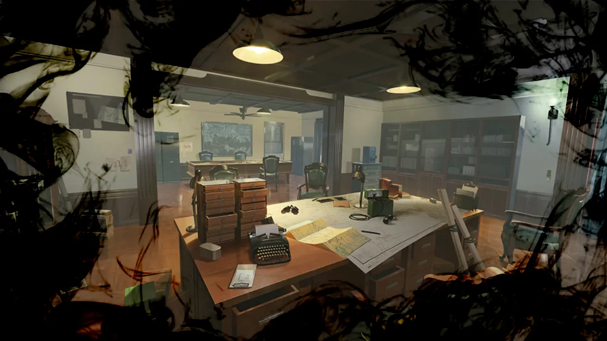









 <!-- конец главы -->

 <!-- начало главы -->

Город Потерянных

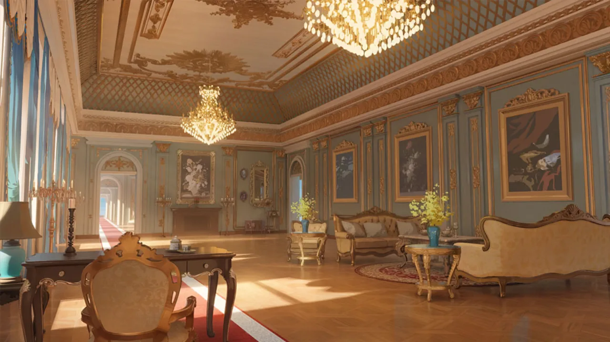









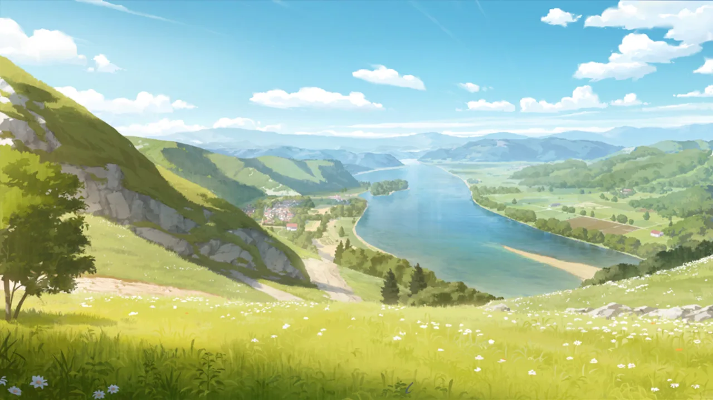



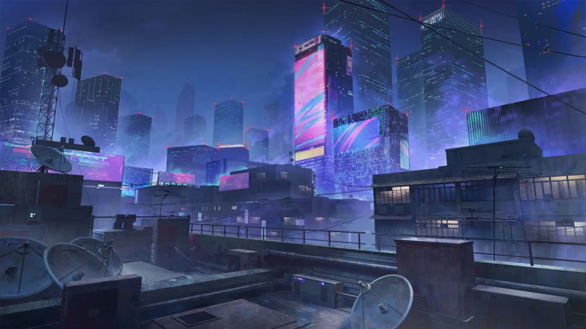




 <!-- конец главы -->