
 <!-- начало главы -->

Утренние новости Моря Звёзд














 <!-- конец главы -->

 <!-- начало главы -->

Море Звёзд и созвездия











 <!-- конец главы -->

 <!-- начало главы -->

Симуляция путешествия в будущее











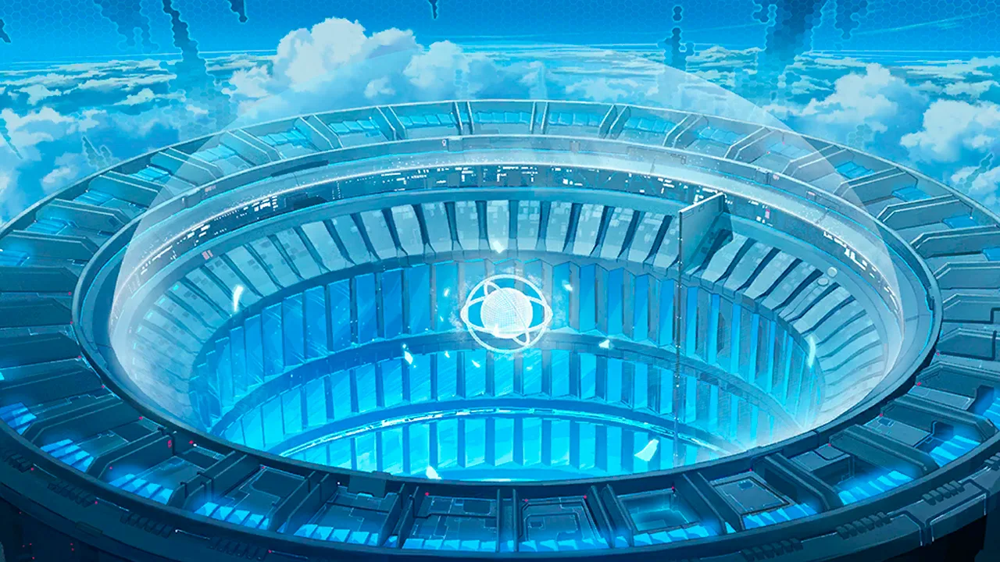




 <!-- конец главы -->

 <!-- начало главы -->

Флот OFS







 <!-- конец главы -->

 <!-- начало главы -->

Дежурство сегодня




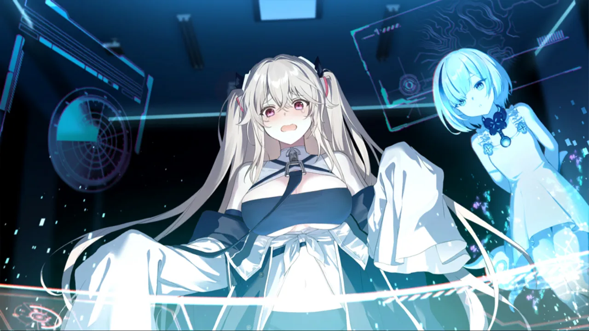







 <!-- конец главы -->

 <!-- начало главы -->

В погоне за светом








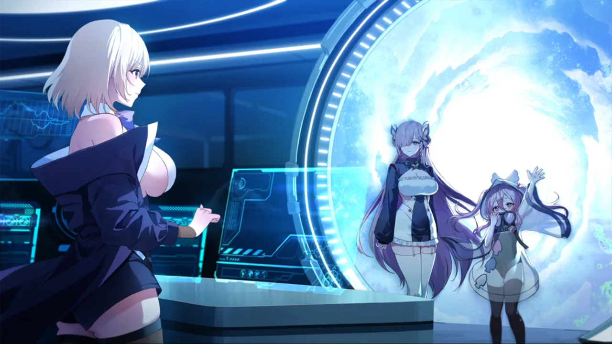



 <!-- конец главы -->

 <!-- начало главы -->

Воспоминания о прошлом

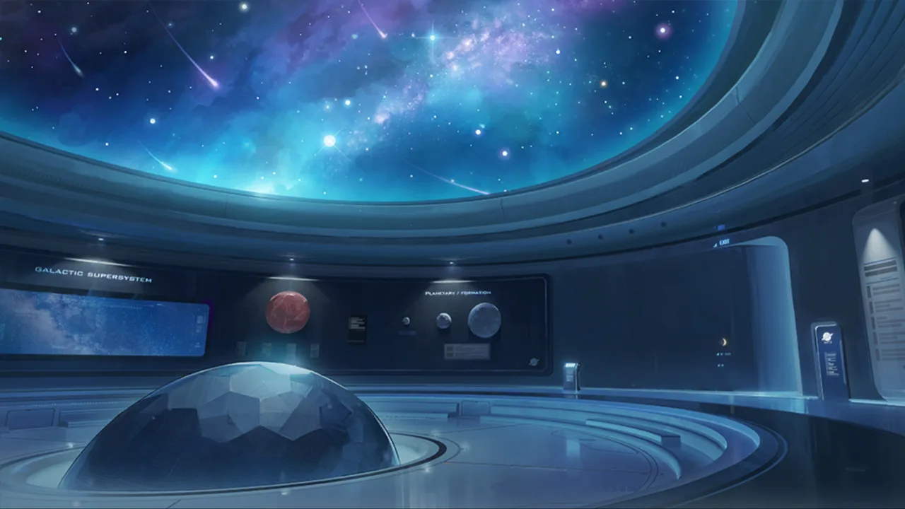



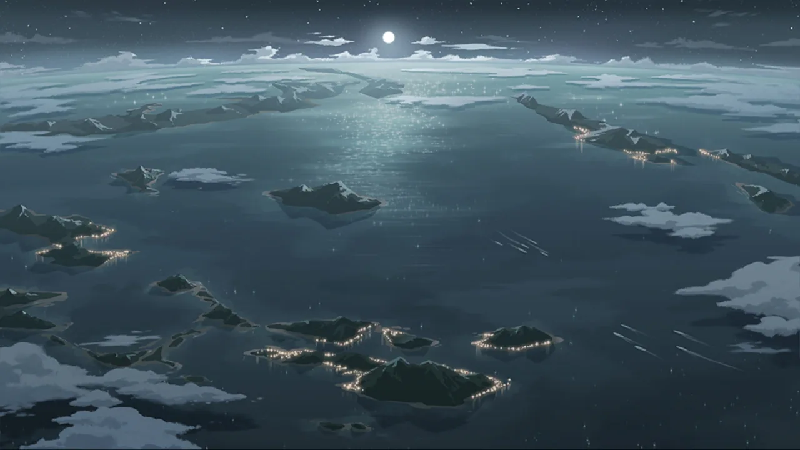




 <!-- конец главы -->

 <!-- начало главы -->

Источник помех



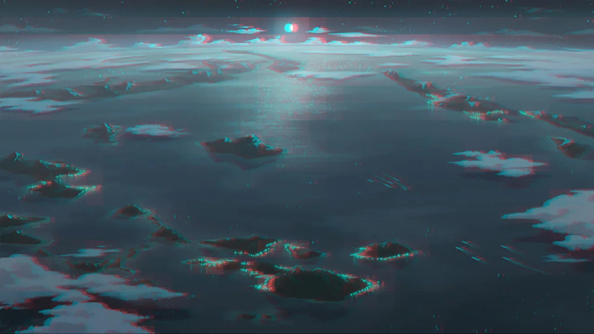








 <!-- конец главы -->

 <!-- начало главы -->

Сгорая от нетерпения





 <!-- конец главы -->

 <!-- начало главы -->

Арбитр Дьявол XV




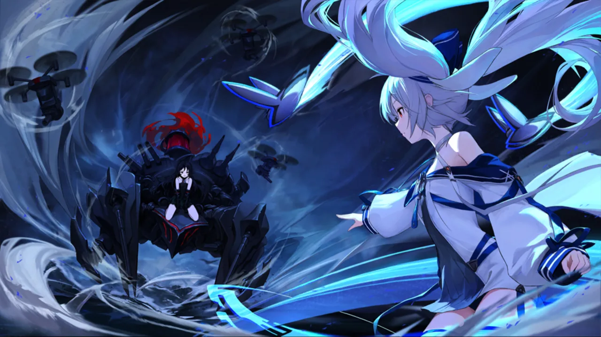



 <!-- конец главы -->

 <!-- начало главы -->

Непредвиденные обстоятельства




 <!-- конец главы -->

 <!-- начало главы -->

Другая возможность














 <!-- конец главы -->

 <!-- начало главы -->

Буря и руины

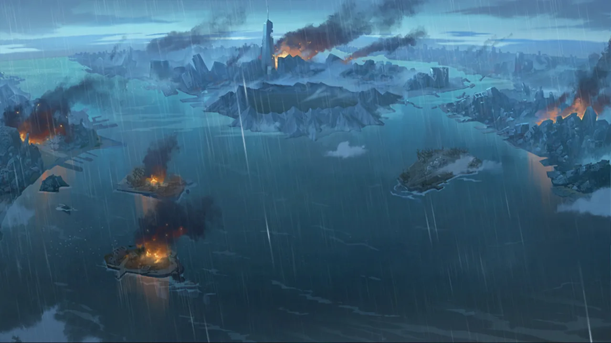



 <!-- конец главы -->

 <!-- начало главы -->

Лаффи II




 <!-- конец главы -->

 <!-- начало главы -->

Дурное предзнаменование




 <!-- конец главы -->

 <!-- начало главы -->

Маяк




 <!-- конец главы -->

 <!-- начало главы -->

Пространственно-временная аномалия



 <!-- конец главы -->

 <!-- начало главы -->

Направленная навигация


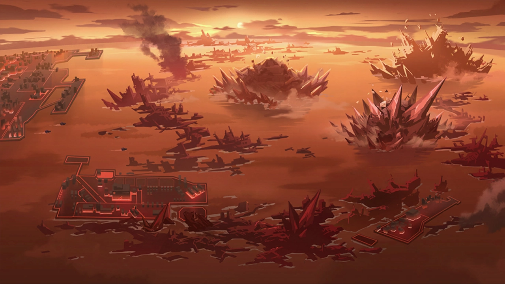













 <!-- конец главы -->

 <!-- начало главы -->

Процедура извлечения
















 <!-- конец главы -->

 <!-- начало главы -->

Совет










 <!-- конец главы -->

 <!-- начало главы -->

Парящий флот




 <!-- конец главы -->

 <!-- начало главы -->

Боевой протокол




 <!-- конец главы -->

 <!-- начало главы -->

Обмен



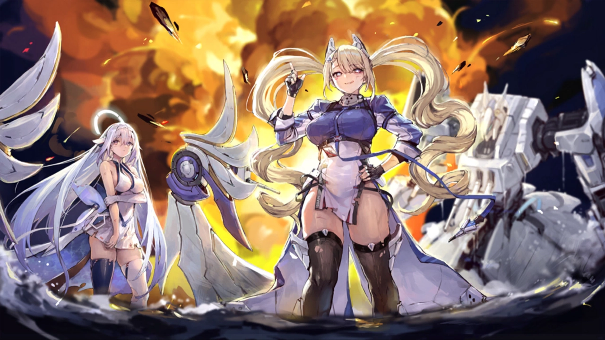



 <!-- конец главы -->

 <!-- начало главы -->

Пересечение
















 <!-- конец главы -->

 <!-- начало главы -->

Прощупывание











 <!-- конец главы -->

 <!-- начало главы -->

Серебряная Лиса







 <!-- конец главы -->

 <!-- начало главы -->

Предвестники Коррозии




 <!-- конец главы -->

 <!-- начало главы -->

Несовместимость







 <!-- конец главы -->

 <!-- начало главы -->

Направление







 <!-- конец главы -->

 <!-- начало главы -->

Шесть вопросов · Часть 1













 <!-- конец главы -->

 <!-- начало главы -->

Шесть вопросов · Часть 2






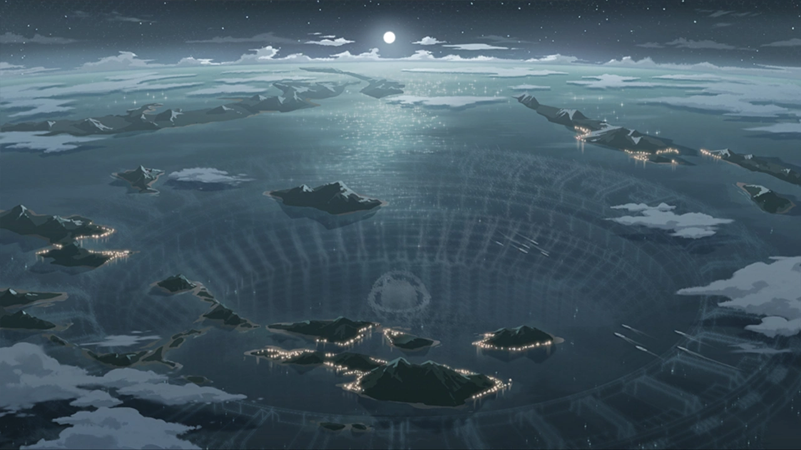





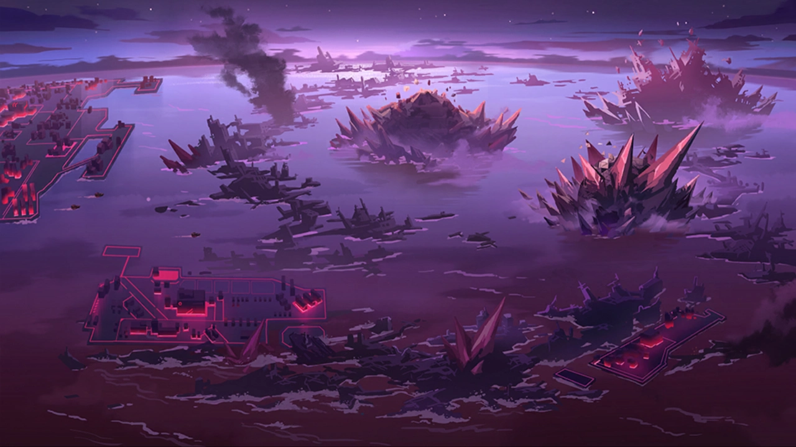




 <!-- конец главы -->

 <!-- начало главы -->

Подведение итогов





 <!-- конец главы -->

 <!-- начало главы -->

Послание издалека








 <!-- конец главы -->

 <!-- начало главы -->

Взаимная выгода





 <!-- конец главы -->

 <!-- начало главы -->

Снова разбита





 <!-- конец главы -->

 <!-- начало главы -->

Внешний рубеж обороны

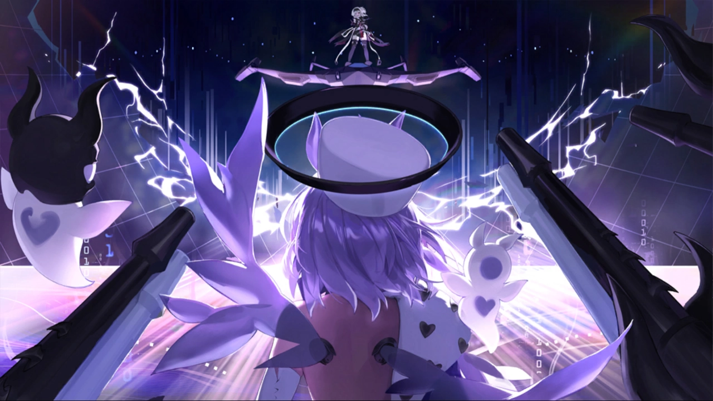







 <!-- конец главы -->

 <!-- начало главы -->

В погоне за светом в Море Звёзд




 <!-- конец главы -->