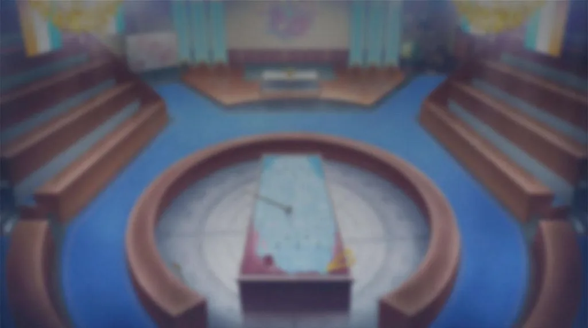
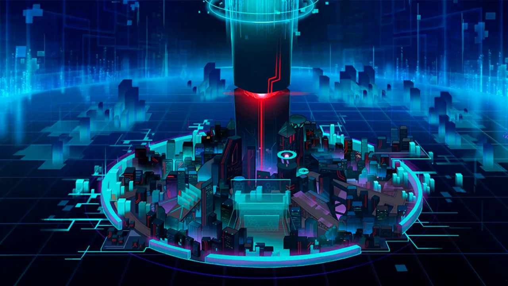
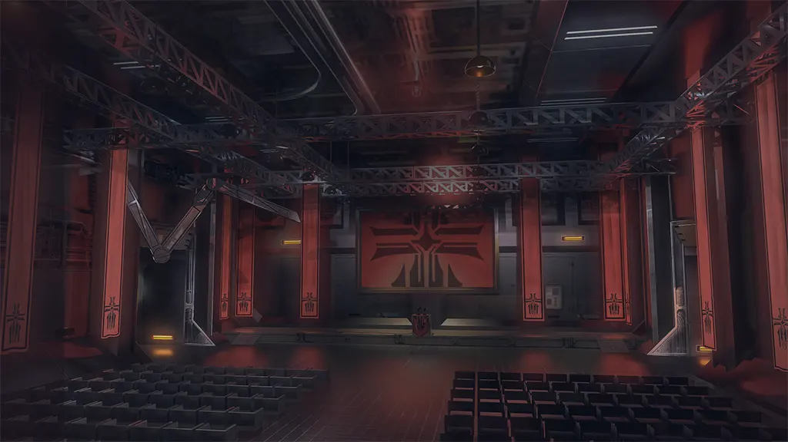
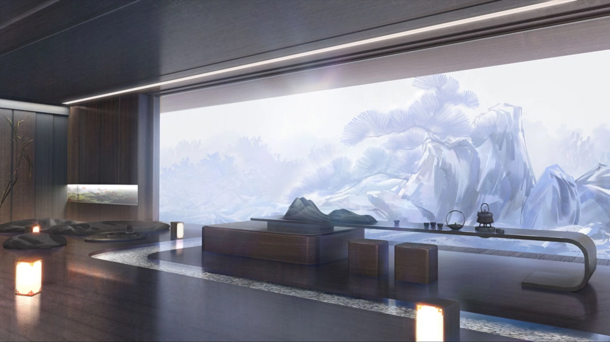

 <!-- начало главы -->

Подготовка к торжеству





 <!-- конец главы -->

 <!-- начало главы -->

Проект «Ороти»








 <!-- конец главы -->

 <!-- начало главы -->

Небольшая передышка





 <!-- конец главы -->

 <!-- начало главы -->

Движущая сила извне













 <!-- конец главы -->

 <!-- начало главы -->

Тайный альянс









 <!-- конец главы -->

 <!-- начало главы -->

Белые ходят первыми





 <!-- конец главы -->

 <!-- начало главы -->

Чёрные ходят вторыми





 <!-- конец главы -->

 <!-- начало главы -->

Явление дракона








 <!-- конец главы -->