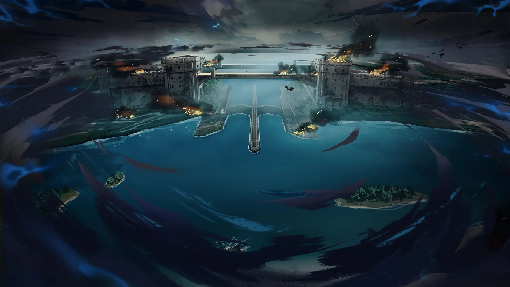

 <!-- начало главы -->

Брифинг операции




 <!-- конец главы -->

 <!-- начало главы -->

Пролог I











 <!-- конец главы -->

 <!-- начало главы -->

Пролог II




 <!-- конец главы -->

 <!-- начало главы -->

Пролог III




 <!-- конец главы -->

 <!-- начало главы -->

Пролог IV




 <!-- конец главы -->

 <!-- начало главы -->

Трубный зов















 <!-- конец главы -->

 <!-- начало главы -->

Дежавю




 <!-- конец главы -->

 <!-- начало главы -->

Система ТБ




 <!-- конец главы -->

 <!-- начало главы -->

Воспоминания





        
    







 <!-- конец главы -->

 <!-- начало главы -->

Огни пожарищ




 <!-- конец главы -->

 <!-- начало главы -->

Другая таинственная личность





        
    







 <!-- конец главы -->

 <!-- начало главы -->

Враг моего врага




 <!-- конец главы -->

 <!-- начало главы -->

Исследование I




 <!-- конец главы -->

 <!-- начало главы -->

Исследование II




 <!-- конец главы -->

 <!-- начало главы -->

Исследование III




 <!-- конец главы -->

 <!-- начало главы -->

Промежуточные успехи







 <!-- конец главы -->

 <!-- начало главы -->

Промежуточные успехи II




 <!-- конец главы -->

 <!-- начало главы -->

Флот Багровой Оси




 <!-- конец главы -->

 <!-- начало главы -->

Связь














 <!-- конец главы -->

 <!-- начало главы -->

Воздушный бой




 <!-- конец главы -->

 <!-- начало главы -->

Перемирие











 <!-- конец главы -->

 <!-- начало главы -->

Подготовительные работы




 <!-- конец главы -->

 <!-- начало главы -->

Подготовка завершена




 <!-- конец главы -->

 <!-- начало главы -->

Маяк META




 <!-- конец главы -->