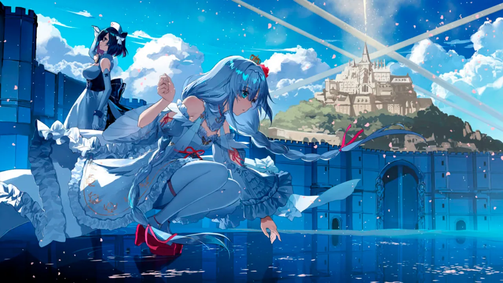
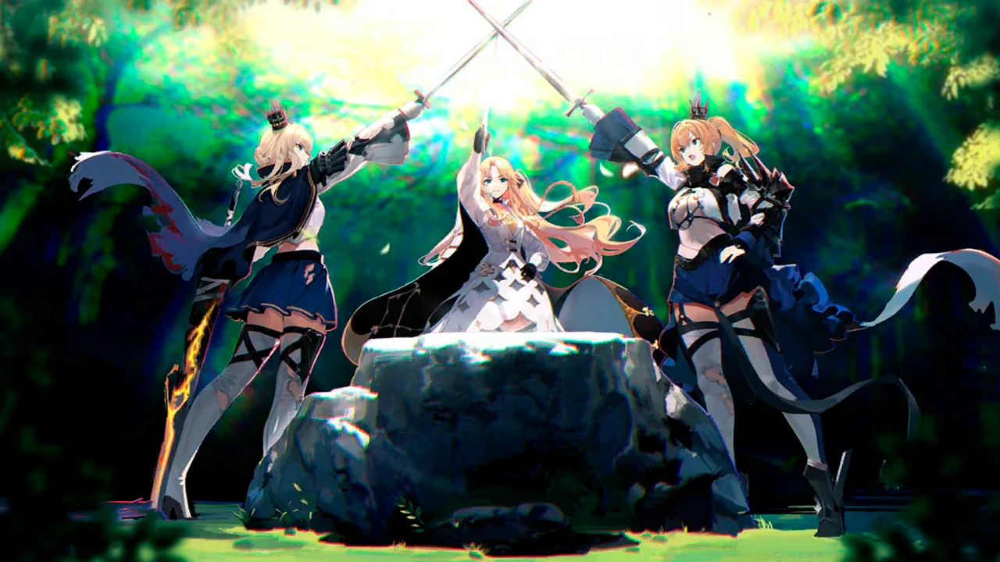
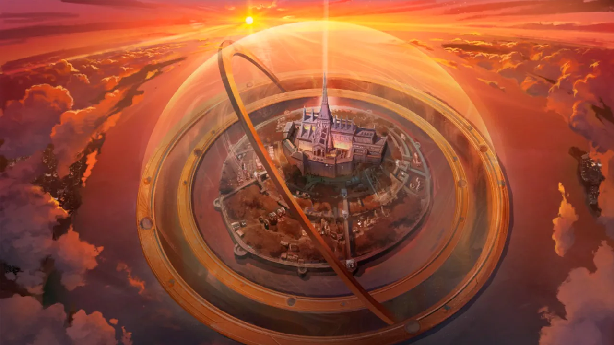
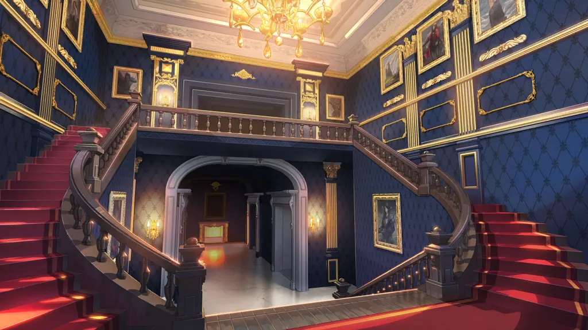
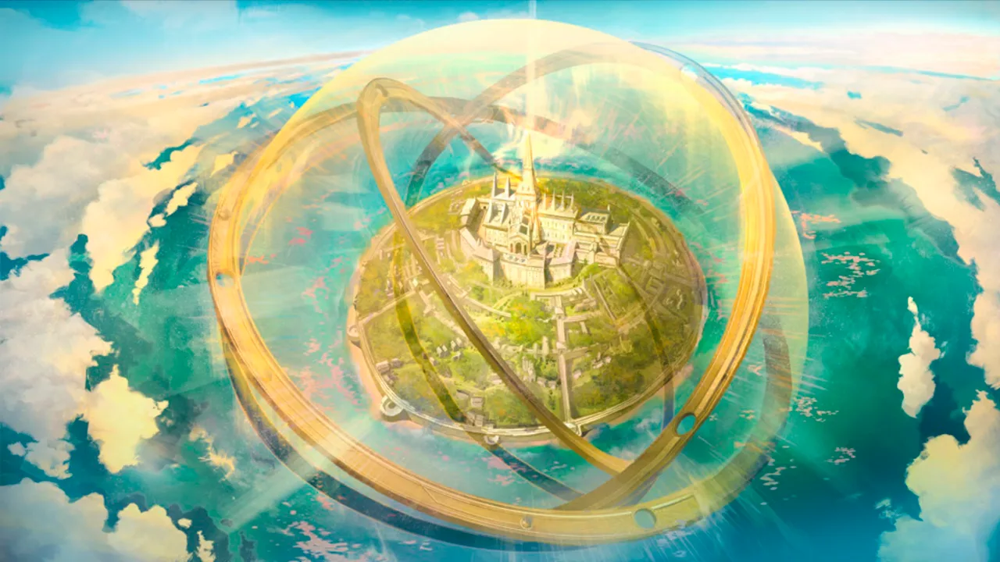
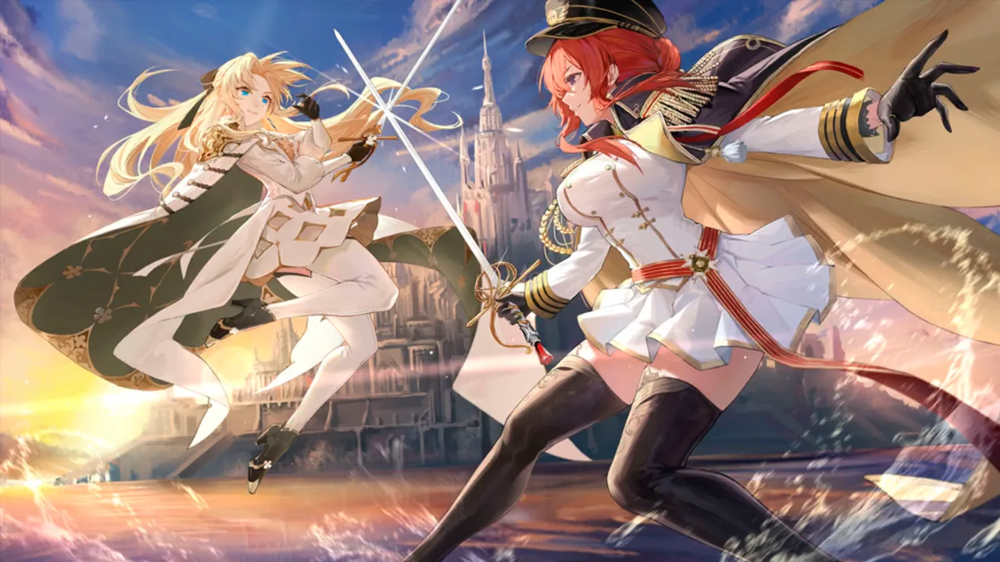
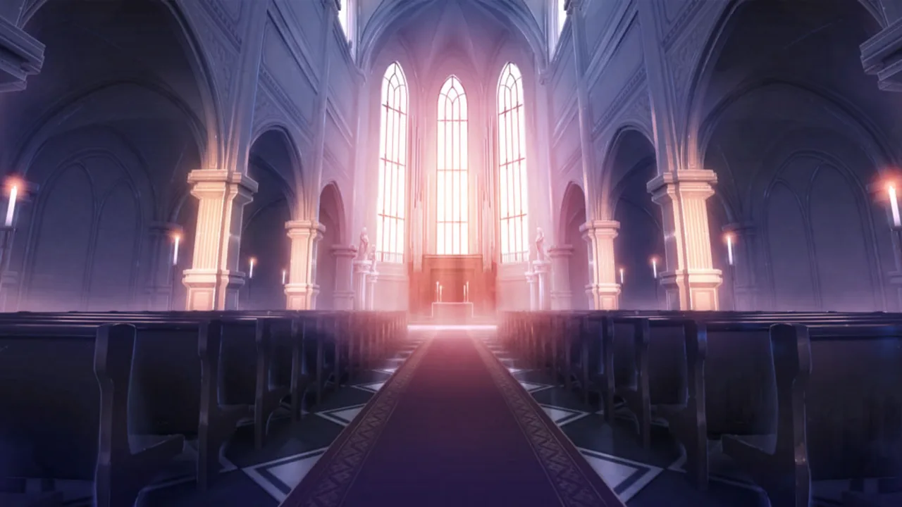

 <!-- начало главы -->

Тихое утро














 <!-- конец главы -->

 <!-- начало главы -->

Прекрасный сад







 <!-- конец главы -->

 <!-- начало главы -->

Та, что в беспамятстве




 <!-- конец главы -->

 <!-- начало главы -->

Лес забвения











 <!-- конец главы -->

 <!-- начало главы -->

Знакомые лица












 <!-- конец главы -->

 <!-- начало главы -->

Обет единства





        
    
















 <!-- конец главы -->

 <!-- начало главы -->

Море разрушения






        
    








 <!-- конец главы -->

 <!-- начало главы -->

Заблудшая душа




 <!-- конец главы -->

 <!-- начало главы -->

Вторжение из иного мира




 <!-- конец главы -->

 <!-- начало главы -->

Город будущего








 <!-- конец главы -->

 <!-- начало главы -->

Час воссоединения








 <!-- конец главы -->

 <!-- начало главы -->

Спасательная операция




 <!-- конец главы -->

 <!-- начало главы -->

Странное путешествие




 <!-- конец главы -->

 <!-- начало главы -->

Путь сомнений




 <!-- конец главы -->

 <!-- начало главы -->

Миг пересечения










 <!-- конец главы -->

 <!-- начало главы -->

Серый Ключ I

        
    




 <!-- конец главы -->

 <!-- начало главы -->

Серый Ключ II

        
    







 <!-- конец главы -->

 <!-- начало главы -->

Серый Ключ III

        
    










 <!-- конец главы -->

 <!-- начало главы -->

Серый Ключ IV

        
    




 <!-- конец главы -->

 <!-- начало главы -->

Серый Ключ V

        
    




 <!-- конец главы -->

 <!-- начало главы -->

Серый Ключ VI

        
    




 <!-- конец главы -->

 <!-- начало главы -->

Струны судьбы





 <!-- конец главы -->

 <!-- начало главы -->

Алый Ключ I

        
    




 <!-- конец главы -->

 <!-- начало главы -->

Алый Ключ II

        
    




 <!-- конец главы -->

 <!-- начало главы -->

Алый Ключ III

        
    




 <!-- конец главы -->

 <!-- начало главы -->

Алый Ключ IV

        
    




 <!-- конец главы -->

 <!-- начало главы -->

Лазурный бриз





 <!-- конец главы -->

 <!-- начало главы -->

Королевский Ключ I

        
    







        
    




 <!-- конец главы -->

 <!-- начало главы -->

В эпицентре шторма




 <!-- конец главы -->

 <!-- начало главы -->

В эпицентре шторма




 <!-- конец главы -->

 <!-- начало главы -->

Меры противодействия







 <!-- конец главы -->

 <!-- начало главы -->

Сигнальные огни




 <!-- конец главы -->

 <!-- начало главы -->

Метод редукции







 <!-- конец главы -->

 <!-- начало главы -->

Метод трёх точек





 <!-- конец главы -->

 <!-- начало главы -->

Сад холодной клятвы








 <!-- конец главы -->

 <!-- начало главы -->

Исход





 <!-- конец главы -->