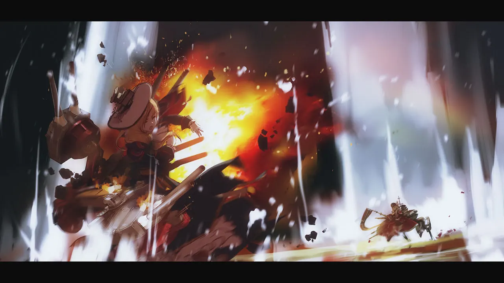
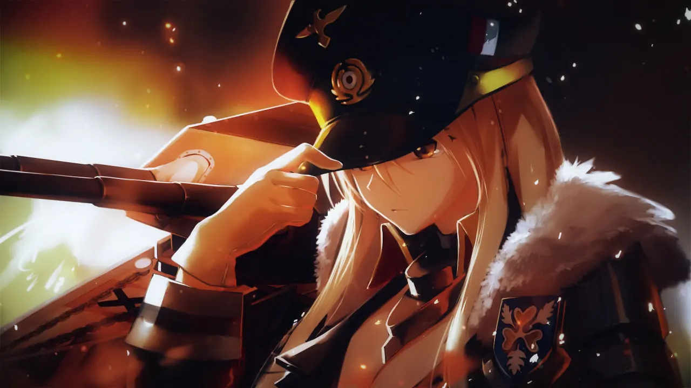

 <!-- начало главы -->

Враги и Мороженое




 <!-- конец главы --> 

 <!-- начало главы -->

Столкновение




 <!-- конец главы --> 

 <!-- начало главы -->

Слава Королевского Флота




 <!-- конец главы --> 

 <!-- начало главы -->

Конфликт




 <!-- конец главы --> 

 <!-- начало главы -->

Рейнский Бур




 <!-- конец главы -->

 <!-- начало главы -->

Конец и Начало










 <!-- конец главы -->

