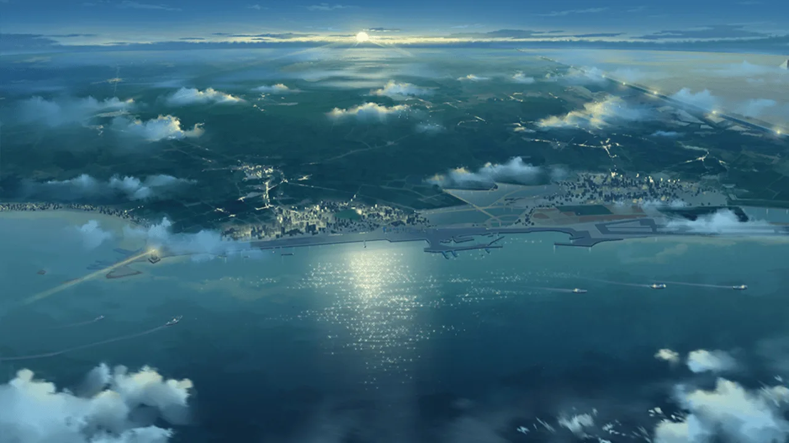
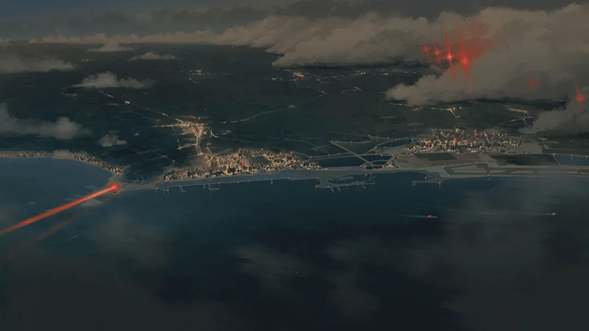
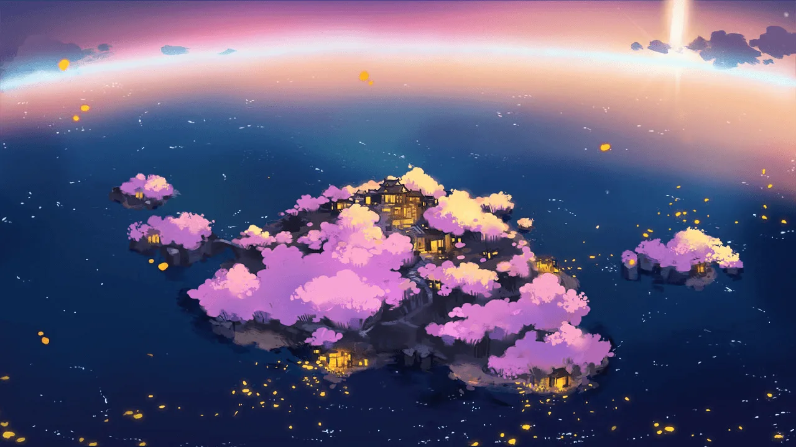

 <!-- начало главы -->

Погода сегодня




 <!-- конец главы -->

 <!-- начало главы -->

Отражение единства






        
    











 <!-- конец главы -->

 <!-- начало главы -->

Путешествие в Империю Сакуры






        
    








 <!-- конец главы -->

 <!-- начало главы -->

Мираж Мёртвого моря





 <!-- конец главы -->

 <!-- начало главы -->

Искра идеала





 <!-- конец главы -->