
 <!-- начало главы -->

Объединение ресурсов

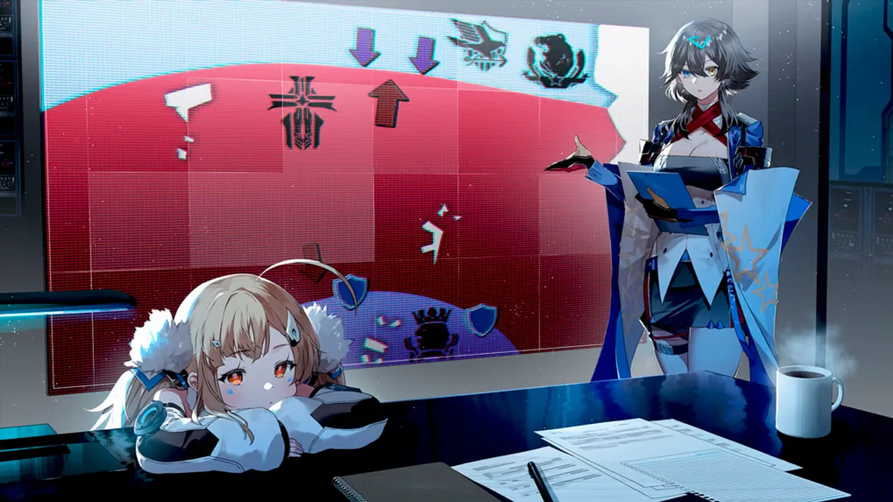










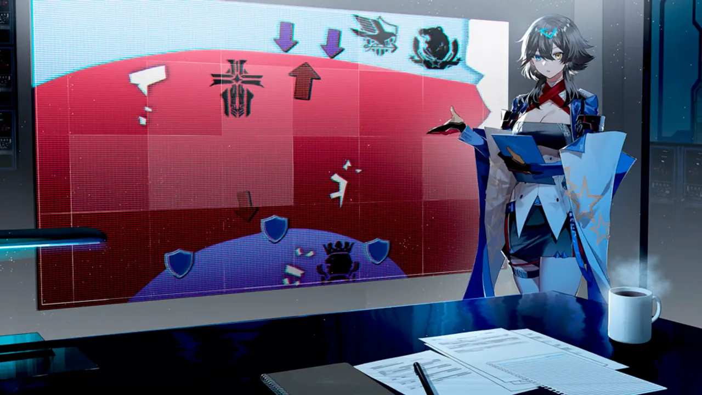








 













 <!-- конец главы -->

 <!-- начало главы -->

Снова в дальний путь





 <!-- конец главы -->

 <!-- начало главы -->

Трофеи








 <!-- конец главы -->

 <!-- начало главы -->

Радужные Врата




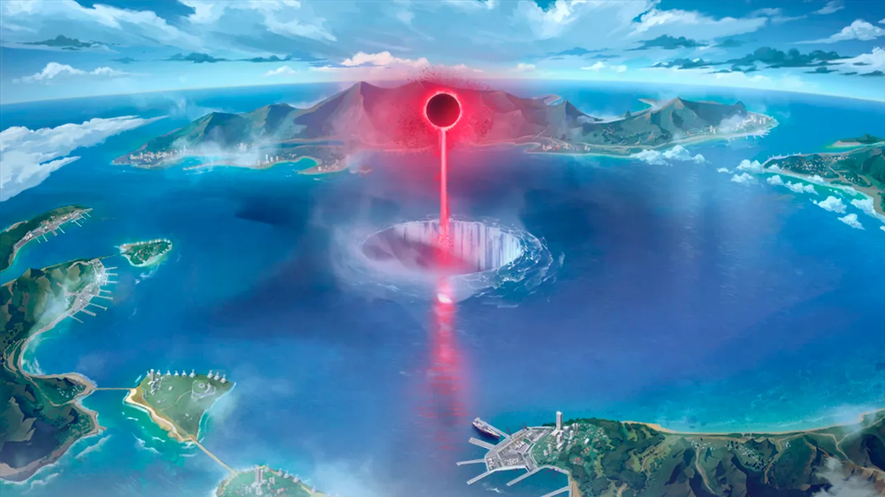



 <!-- конец главы -->

 <!-- начало главы -->

Сингулярность




 <!-- конец главы -->

 <!-- начало главы -->

Контрмеры





 <!-- конец главы -->

 <!-- начало главы -->

Сотворение

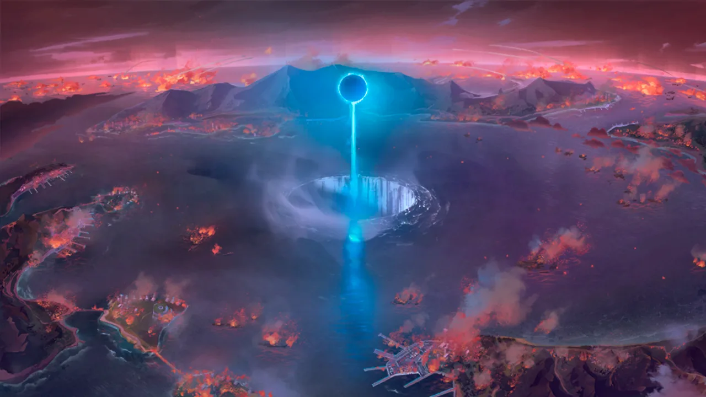



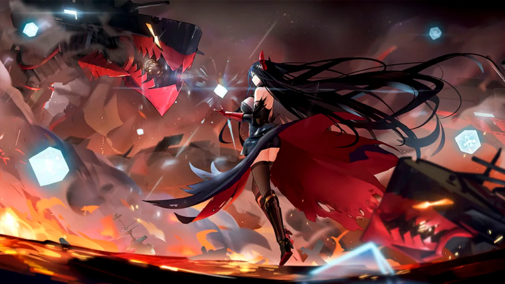


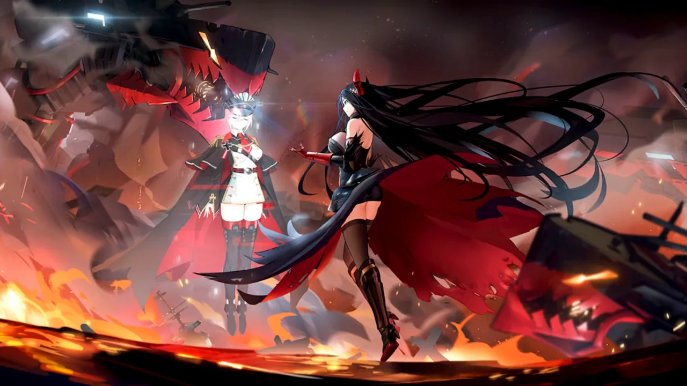



 <!-- конец главы -->

 <!-- начало главы -->

Перерождение



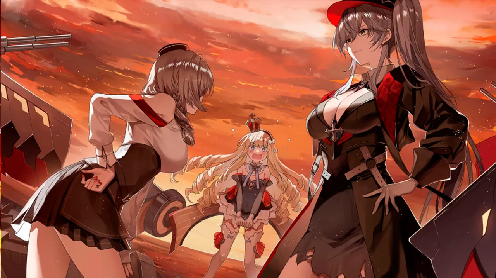



 <!-- конец главы -->

 <!-- начало главы -->

Прошлое





        
    










        
    










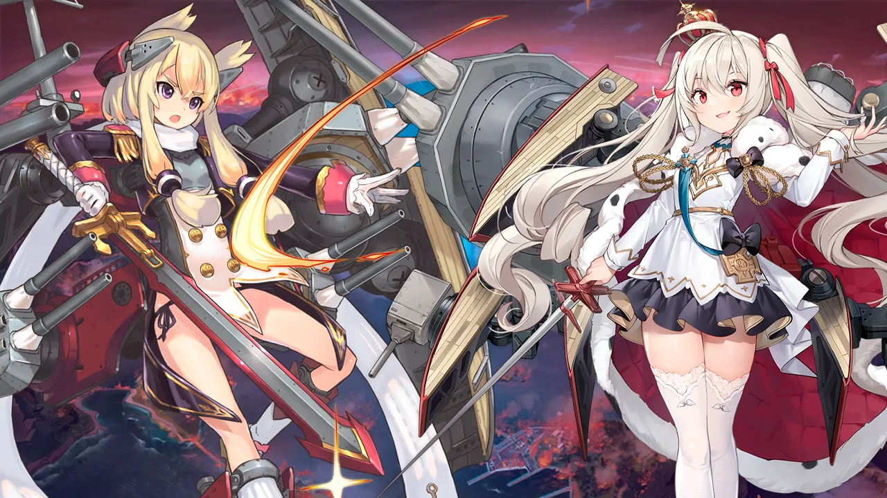



 <!-- конец главы -->

 <!-- начало главы -->

Истина





        
    









        
    









 <!-- конец главы -->

 <!-- начало главы -->

Пробная атака





 <!-- конец главы -->

 <!-- начало главы -->

Старое и новое





 <!-- конец главы -->

 <!-- начало главы -->

Адаптация










 <!-- конец главы -->

 <!-- начало главы -->

Сотворение истории




 <!-- конец главы -->

 <!-- начало главы -->

Новое и старое




 <!-- конец главы -->

 <!-- начало главы -->

Начало конца



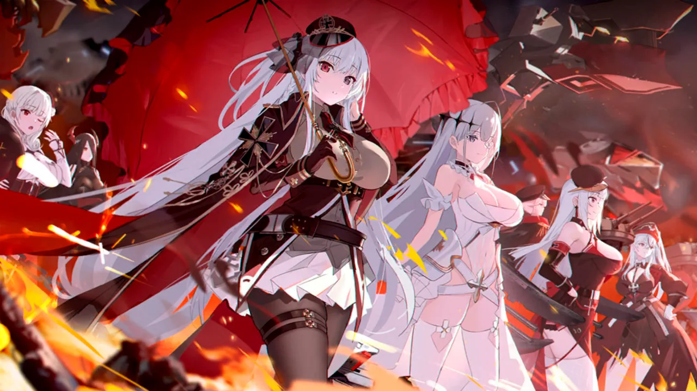



 <!-- конец главы -->

 <!-- начало главы -->

Частная связь




 <!-- конец главы -->

 <!-- начало главы -->

Разговор по душам





 <!-- конец главы -->

 <!-- начало главы -->

Подкрепление











 <!-- конец главы -->

 <!-- начало главы -->

Сдерживающее сражение










 

 <!-- конец главы -->

 <!-- начало главы -->

Интерлюдия





 <!-- конец главы -->

 <!-- начало главы -->

Сводка разведданных












 <!-- конец главы -->

 <!-- начало главы -->

Скоординированная операция












 <!-- конец главы -->

 <!-- начало главы -->

Момент истины























 









 <!-- конец главы -->

 <!-- начало главы -->

Выбор

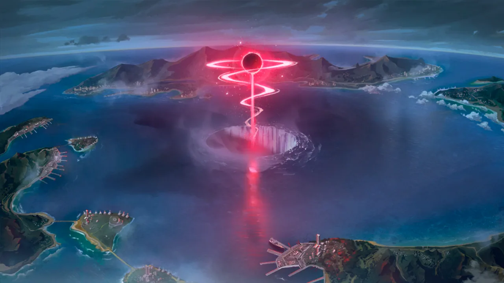




 <!-- конец главы -->

 <!-- начало главы -->

Глава мятежа




 <!-- конец главы -->

 <!-- начало главы -->

Разрушитель стали











 <!-- конец главы -->

 <!-- начало главы -->

Мейнфрейм

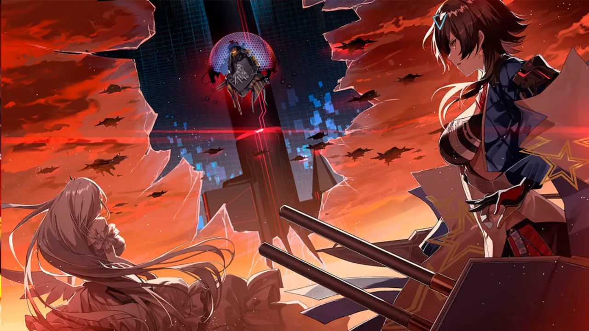






 <!-- конец главы -->

 <!-- начало главы -->

Башня данных





 <!-- конец главы -->

 <!-- начало главы -->

Башня данных

































 











































 <!-- конец главы -->

 <!-- начало главы -->

Новое путешествие






 <!-- конец главы -->

 <!-- начало главы -->

74 6F 77 65 72 (Башня)

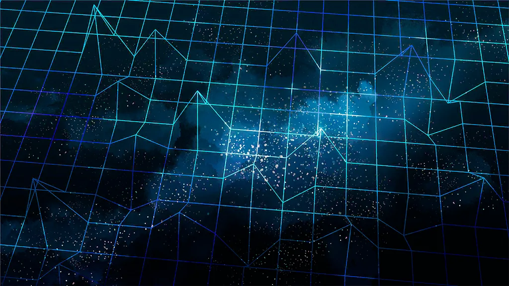













 <!-- конец главы -->

 <!-- начало главы -->

Что есть Ортодоксия

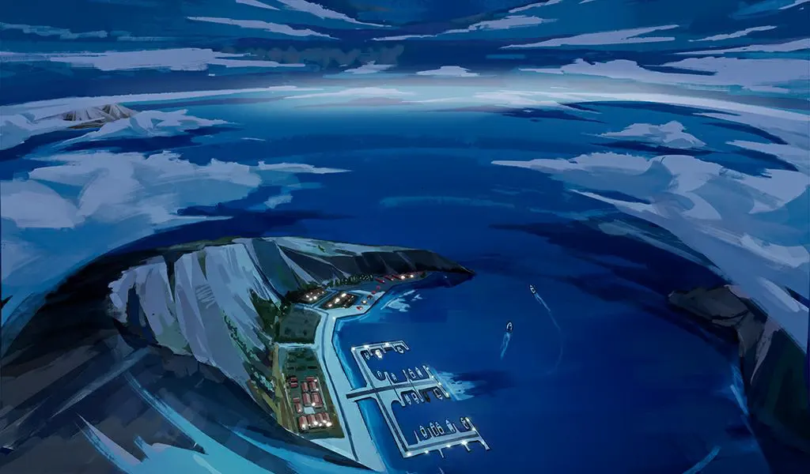




 <!-- конец главы -->

 <!-- начало главы -->

Бытие





 <!-- конец главы -->