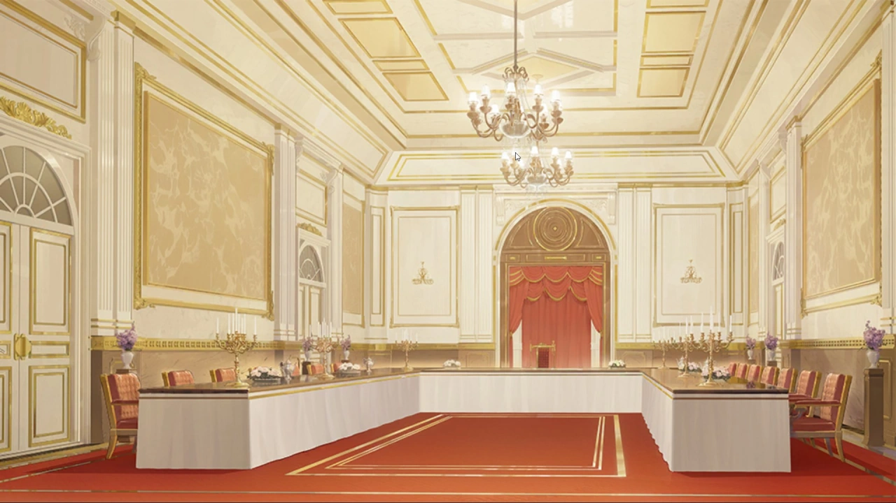
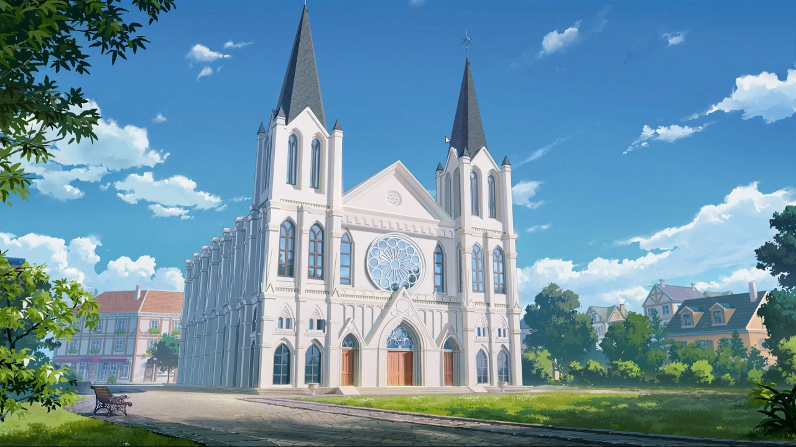
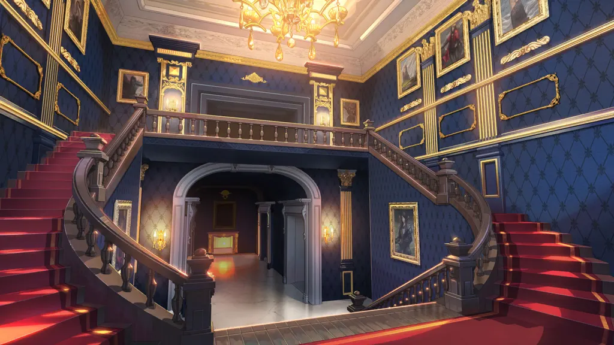
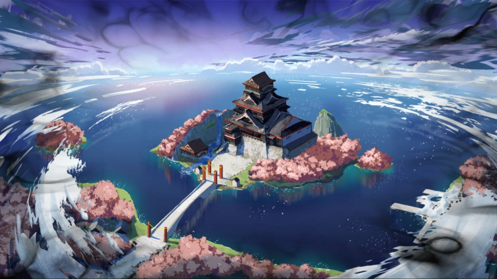

 <!-- начало главы -->

На подъёме




 <!-- конец главы -->

 <!-- начало главы -->

Программа обмена











 <!-- конец главы -->

 <!-- начало главы -->

Неопределённость





 <!-- конец главы -->

 <!-- начало главы -->

Выходной спецагента








 <!-- конец главы -->

 <!-- начало главы -->

Сплетение миров









 <!-- конец главы -->

 <!-- начало главы -->

Чаепитие королевы





 <!-- конец главы -->

 <!-- начало главы -->

Мазок киновари













 <!-- конец главы -->