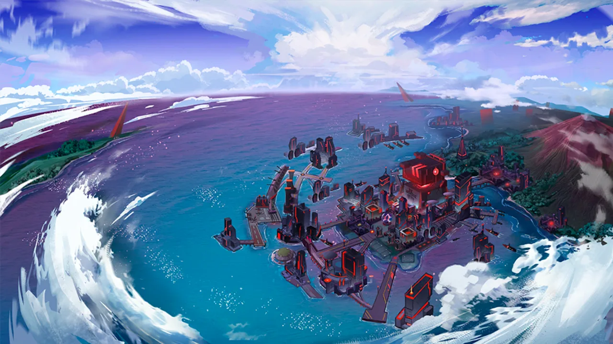
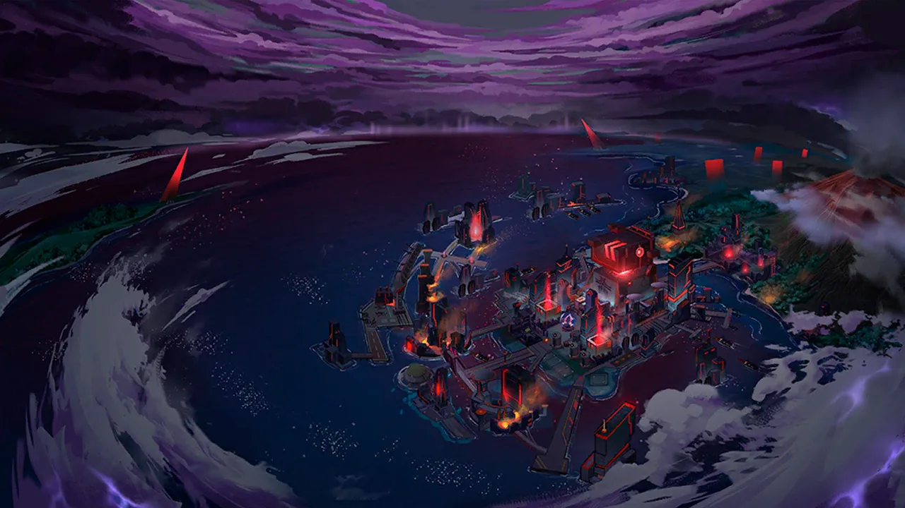

 <!-- начало главы -->

Коррозия











 <!-- конец главы -->

 <!-- начало главы -->

Смятение





 <!-- конец главы -->

 <!-- начало главы -->

Расследование





 <!-- конец главы -->

 <!-- начало главы -->

Прощание








 <!-- конец главы -->

 <!-- начало главы -->

Тихие размышления





 <!-- конец главы -->

 <!-- начало главы -->

Рябь





 <!-- конец главы -->

 <!-- начало главы -->

Звук горна








 <!-- конец главы -->