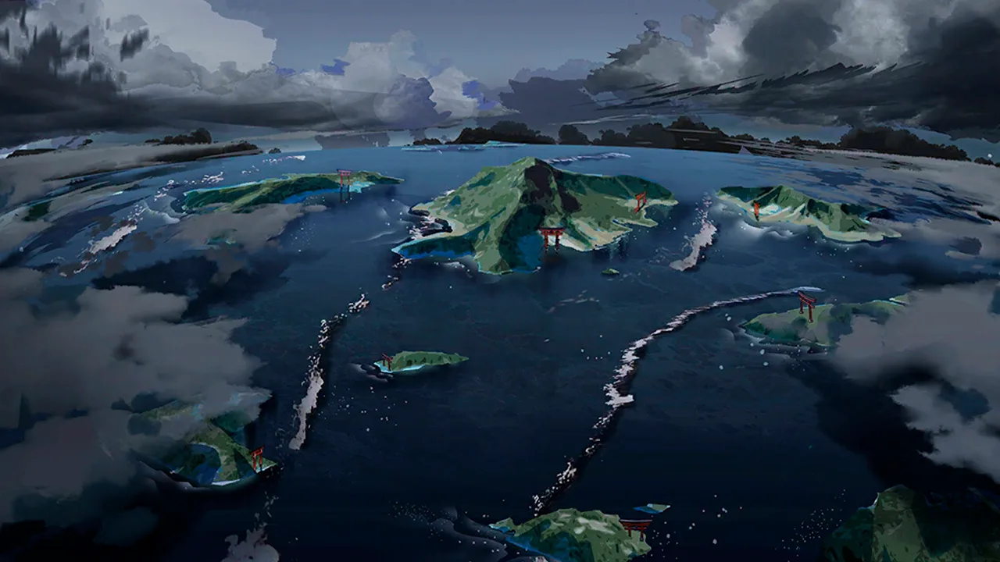
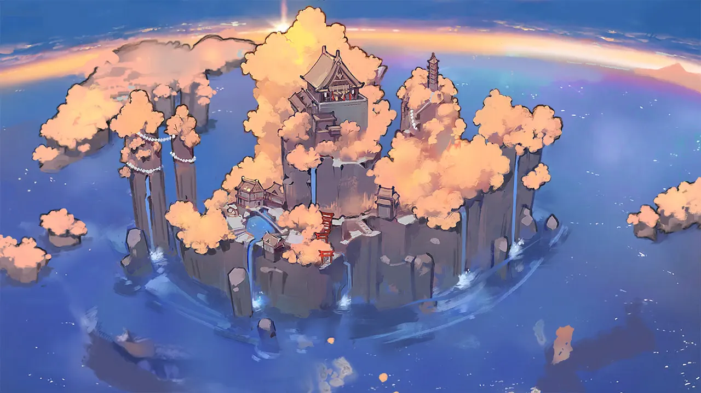
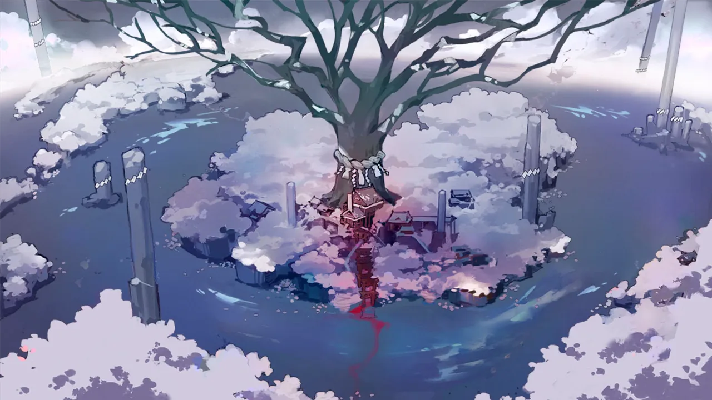
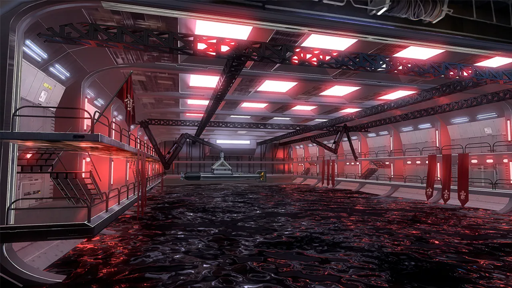
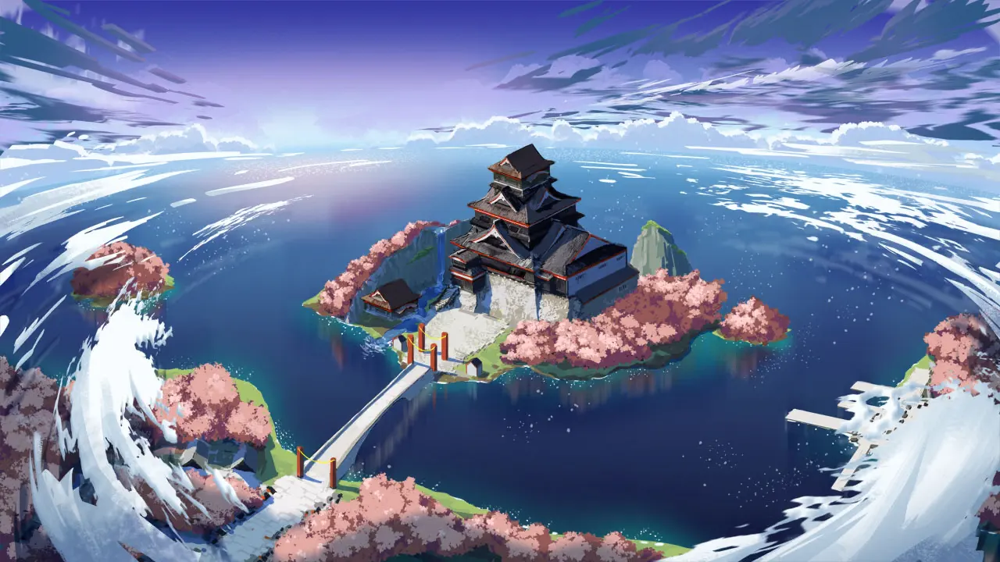
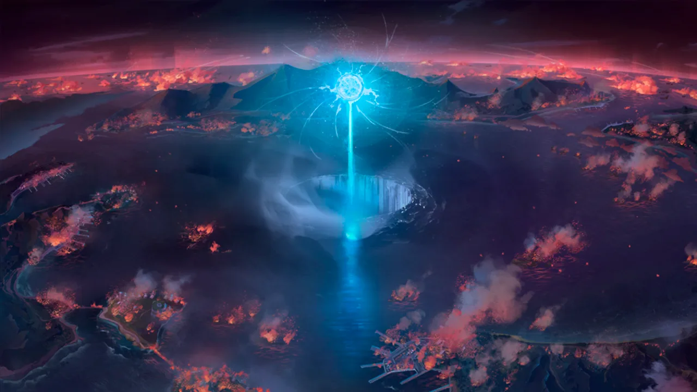

 <!-- начало главы -->

Гостья среди облаков








 <!-- конец главы -->

 <!-- начало главы -->

Чистое небо, нарастающие волны








 <!-- конец главы -->

 <!-- начало главы -->

Сгущающиеся тучи








 <!-- конец главы --> 

 <!-- начало главы -->

Увядшее цветение





 <!-- конец главы --> 

 <!-- начало главы -->

Сосуды и замены





 <!-- конец главы --> 

 <!-- начало главы -->

Индиговая печать









 <!-- конец главы --> 

 <!-- начало главы -->

Расходящиеся пути






        
    








 <!-- конец главы -->